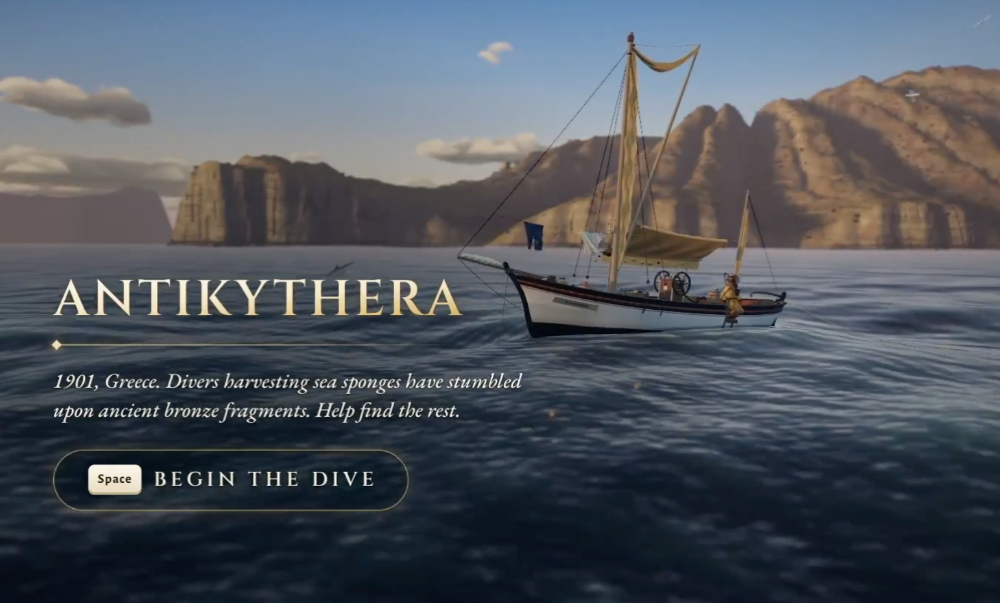
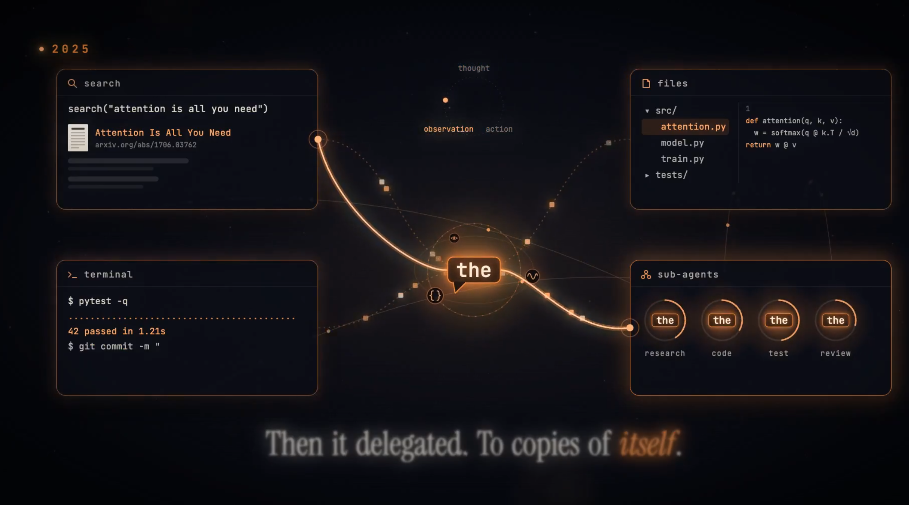
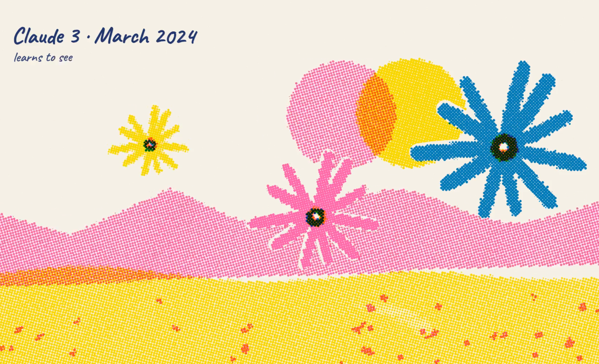

# Awesome Opus Animation

收集 AI 模型参与制作的优秀动画案例，记录作者、所用模型、提示词、样片与原帖，方便欣赏、学习和复现。目前以 Claude Opus 5.5 作品为主，后续也可收录其他模型的作品。

> 正在收录中。欢迎提供 X 原帖链接；优先收录作者本人发布、明确说明所用模型的作品。

首页按分类展示精选作品预览，每行 3 个；点击分类标题查看全部案例，点击封面观看样片，点击作品名查看详情。

## 分类

### [游戏与可玩动画](categories/games.md)

13 个案例

<p align="center">
<a href="https://x.com/edwinarbus/status/2102463453176979794"></a>
<a href="https://x.com/ring_hyacinth/status/2102865595675050010"></a>
<a href="https://x.com/LexnLin/status/2102834362530079093"></a><br>
<a href="categories/games.md#case-2102463453176979794">安提基特拉机械游戏</a> · <a href="categories/games.md#case-2102865595675050010">像素上海：弄堂电台</a> · <a href="categories/games.md#case-2102834362530079093">Arkenfall</a>
</p>

<p align="center">
<a href="https://x.com/notjazii/status/2102831012686573744"></a>
<a href="https://x.com/The_Alex/status/2102440678282412195"></a>
<a href="https://x.com/nachat_dayo/status/2102773498037023140"></a><br>
<a href="categories/games.md#case-2102831012686573744">火柴人游戏</a> · <a href="categories/games.md#case-2102440678282412195">Dark Souls 风格游戏演示</a> · <a href="categories/games.md#case-2102773498037023140">鱼叉捕鱼游戏</a>
</p>

### [代码动画与视觉实验](categories/code-animation.md)

15 个案例

<p align="center">
<a href="https://x.com/chetaslua/status/2102501773705670994"></a>
<a href="https://x.com/riku720720/status/2102515055116063144"></a>
<a href="https://x.com/prasenx/status/2102717687604633959"></a><br>
<a href="categories/code-animation.md#case-2102501773705670994">Steam Song（交互式定格动画）</a> · <a href="categories/code-animation.md#case-2102515055116063144">宇宙像素疾走</a> · <a href="categories/code-animation.md#case-2102717687604633959">浏览器里的骑行</a>
</p>

<p align="center">
<a href="https://x.com/shitunote/status/2103033624463585327"></a>
<a href="https://x.com/petergyang/status/2102849349122470205"></a>
<a href="https://x.com/NFT_Chen/status/2102681172367323300"></a><br>
<a href="categories/code-animation.md#case-2103033624463585327">鹈鹕骑行 SVG 动画</a> · <a href="categories/code-animation.md#case-2102849349122470205">Watch Claude Paint</a> · <a href="categories/code-animation.md#case-2102681172367323300">Claude 的卡通剪辑台</a>
</p>

### [叙事短片与角色动画](categories/narrative.md)

12 个案例

<p align="center">
<a href="https://x.com/nicekate8888/status/2102575622912631261"></a>
<a href="https://x.com/angrypenguinPNG/status/2102611372978872504"></a>
<a href="https://x.com/chetaslua/status/2102717699600368045"></a><br>
<a href="categories/narrative.md#case-2102575622912631261">Opus 5.5 自我介绍短片</a> · <a href="categories/narrative.md#case-2102611372978872504">Opus 的梦</a> · <a href="categories/narrative.md#case-2102717699600368045">Claude's Plan</a>
</p>

### [手绘动画与 MV](categories/hand-drawn-mv.md)

5 个案例

<p align="center">
<a href="https://x.com/donaldjewkes/status/2102801274173587569"></a>
<a href="https://x.com/ring_hyacinth/status/2102986085328716066"></a>
<a href="https://x.com/eudaemonea/status/2102610626321490404"></a><br>
<a href="categories/hand-drawn-mv.md#case-2102801274173587569">Claude Pop 重制 MV</a> · <a href="categories/hand-drawn-mv.md#case-2102986085328716066">中秋拼贴动画</a> · <a href="categories/hand-drawn-mv.md#case-2102610626321490404">Functional Emotions 音乐视频</a>
</p>

### [3D 场景与交互](categories/3d-scenes.md)

12 个案例

<p align="center">
<a href="https://x.com/dotey/status/2102940980379017293"></a>
<a href="https://x.com/NFT_Chen/status/2102672063668670725"></a>
<a href="https://x.com/ishuagra02/status/2102543638689460488"></a><br>
<a href="categories/3d-scenes.md#case-2102940980379017293">桃源 · 豁然开朗（《桃花源记》）</a> · <a href="categories/3d-scenes.md#case-2102672063668670725">雨夜街角便利店</a> · <a href="categories/3d-scenes.md#case-2102543638689460488">Autumn Line（秋日铁道）</a>
</p>

### [科普与信息可视化](categories/explainers.md)

5 个案例

<p align="center">
<a href="https://x.com/RyanSael/status/2102591147927654847"></a>
<a href="https://x.com/kimmonismus/status/2102844654169575547"></a>
<a href="https://x.com/superalesha/status/2102463796149440888"></a><br>
<a href="categories/explainers.md#case-2102591147927654847">The Plane of Focus（对焦平面）</a> · <a href="categories/explainers.md#case-2102844654169575547">AI 历史：从 Attention Is All You Need 到 AGI</a> · <a href="categories/explainers.md#case-2102463796149440888">Claude 模型发展史</a>
</p>

### [动效与品牌设计](categories/motion-design.md)

5 个案例

<p align="center">
<a href="https://x.com/gregpr07/status/2102984873351037161"></a>
<a href="https://x.com/decohack/status/2102621064518160485"></a><br>
<a href="categories/motion-design.md#case-2102984873351037161">video-use 发布短片</a> · <a href="categories/motion-design.md#case-2102621064518160485">Applore 产品宣传片</a>
</p>

<p align="center">
<a href="https://x.com/Ror_Fly/status/2102853258582880547"></a><br>
<a href="categories/motion-design.md#case-2102853258582880547">鸡尾酒配方动效</a>
</p>

## 收录规则

- 优先使用作者的 X 原帖作为来源，保留作者署名和可观看的样片链接；转发帖不能代替原帖。
- 记录使用的模型与版本，区分 **模型生成动画代码**、**模型参与制作流程** 和 **视频生成模型直接生成画面**。无法确认模型参与情况的案例暂不收录。
- 提示词优先记录作者公开的原文并附来源链接。仅由投稿者提供且尚无公开出处时，明确标记「出处待核对」；未公开时标注「未公开」，不要根据成片反推或编造。
- 一个作品归入最贴切的一个分类；同一作品的更新版本可以在备注中补充链接。
- 样片优先链接到作者发布的视频或在线演示，不搬运未获授权的媒体文件。
- 每个分类页先放视频预览表格，每行最多三项；横屏、方屏（含近方屏）、竖屏封面分别成行。不足三项的行留空，后续新增案例可补入对应比例的空位。
- 预览使用原帖的视频封面或经核对的视频截图，点击封面跳转作者原帖；点击作品名称跳转本页详情。详情记录样片、制作耗时（若公开）、制作说明和有出处的提示词，不重复插入封面。

## 推荐案例

提交一个 X 原帖链接即可。若有更多信息，也欢迎按下面的格式补充：

```text
作品名称：
作者：
分类：叙事短片与角色动画 / 手绘动画与 MV / 代码动画与视觉实验 / 3D 场景与交互 / 游戏与可玩动画 / 科普与信息可视化 / 动效与品牌设计
使用模型及版本：
X 原帖：
样片或在线演示：
制作耗时：（若作者公开）
提示词原文及出处：（未公开可留空）
模型的参与方式：
```

欢迎通过 Issue 或 Pull Request 参与，具体步骤见[贡献指南](CONTRIBUTING.md)。参与讨论请遵守[行为准则](CODE_OF_CONDUCT.md)。

## 许可

仓库文件采用 [MIT License](LICENSE)；所链接或引用的第三方作品与素材仍归原权利人所有。

<!-- 新案例模板：先在对应分类页的表格中补入一个单元格，每行最多三个；横屏、方屏（含近方屏）、竖屏分别成行。再把详情复制到该分类页的表格下方。POST_ID 使用 X 原帖数字 ID。

<td width="33%" valign="top" align="center"><a href="https://x.com/handle/status/POST_ID"></a><br><strong><a href="#case-POST_ID">作品名称</a></strong><br><a href="https://x.com/handle">@handle</a></td>

方屏封面宽度可用 240；竖屏封面宽度可用 180。

<a id="case-POST_ID"></a>

### 作品名称

- **作者**：[@handle](https://x.com/handle)
- **样片**：[观看视频](https://x.com/handle/status/POST_ID) / [在线体验](https://example.com)
- **原帖**：[查看作者原帖](https://x.com/handle/status/POST_ID)
- **制作耗时**：作者公开时填写，未公开时删除本行
- **实现**：使用的模型及版本、参与方式、技术或工具
- **提示词**：公开 / 部分公开 / 未公开

> 作者公开的提示词原文。没有公开提示词时删除这一段。

提示词来源：[X 帖子](https://x.com/handle/status/POST_ID)。

-->
