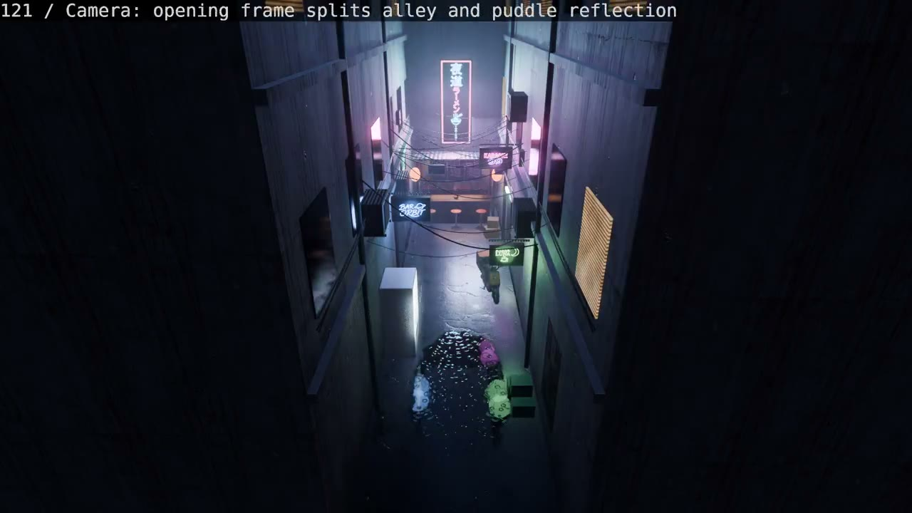
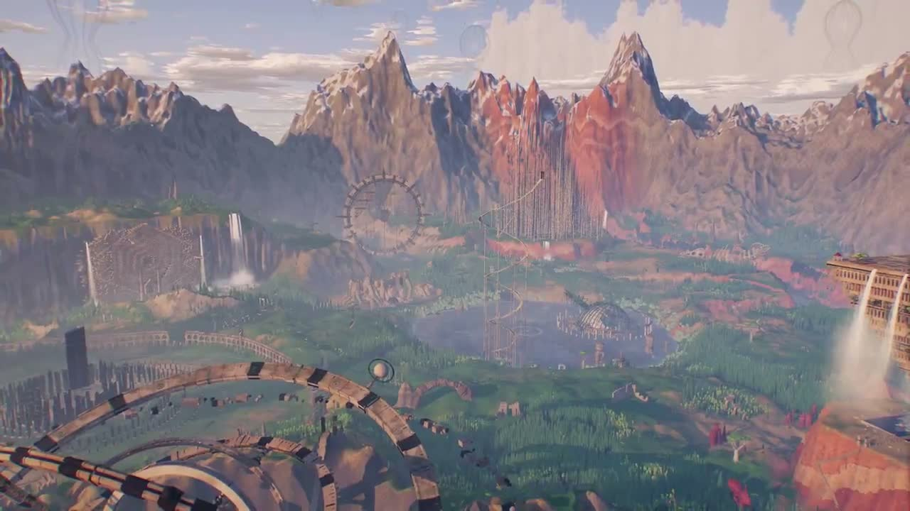

# 3D 场景与交互

[English](3d-scenes.md) | **简体中文**

[返回首页](../README.zh-CN.md)

共 20 个案例。

## 作品预览

<table>
<tr>
<td width="33%" valign="top" align="center"> <strong><a href="#case-2102483668468195539">Unreal Engine 旧金山街景</a></strong> <a href="https://x.com/MatthewBerman">Matthew Berman @MatthewBerman</a></td>
<td width="33%" valign="top" align="center"> <strong><a href="#case-2102543638689460488">Autumn Line（秋日铁道）</a></strong> <a href="https://x.com/ishuagra02">Ishu Agrawal @ishuagra02</a></td>
<td width="33%" valign="top" align="center"> <strong><a href="#case-2102672063668670725">雨夜街角便利店</a></strong> <a href="https://x.com/NFT_Chen">SuSu_酥酥 @NFT_Chen</a></td>
</tr>
<tr>
<td width="33%" valign="top" align="center"> <strong><a href="#case-2102779917247054301">中世纪城堡：Opus 4.6 与 5.5 对比</a></strong> <a href="https://x.com/chaseleantj">Chase Lean @chaseleantj</a></td>
<td width="33%" valign="top" align="center"> <strong><a href="#case-2102940980379017293">桃源 · 豁然开朗（《桃花源记》）</a></strong> <a href="https://x.com/dotey">宝玉 @dotey</a></td>
<td width="33%" valign="top" align="center"> <strong><a href="#case-2102878170089169235">交互式岛屿生态</a></strong> <a href="https://x.com/dangreenheck">Dan Greenheck @dangreenheck</a></td>
</tr>
<tr>
<td width="33%" valign="top" align="center"> <strong><a href="#case-2102684366996738511">Powapowa Village（ぽわぽわむら）</a></strong> <a href="https://x.com/studio_veco">Studio Veco @studio_veco</a></td>
<td width="33%" valign="top" align="center"> <strong><a href="#case-2102503719762018434">从草图到住宅</a></strong> <a href="https://x.com/techartist_">Techartist @techartist_</a></td>
<td width="33%" valign="top" align="center"> <strong><a href="#case-2102487989381156991">Blender 动画实验</a></strong> <a href="https://x.com/superalesha">Alexey Fateev @superalesha</a></td>
</tr>
<tr>
<td width="33%" valign="top" align="center"> <strong><a href="#case-2102771402210476533">GPT-6 Luna 3D 动画实验</a></strong> <a href="https://x.com/seftsaint">eta @seftsaint</a></td>
<td width="33%" valign="top" align="center"> <strong><a href="#case-2102458348511879448">一条提示词制作 Blender 黏土动画</a></strong> <a href="https://x.com/alexalbert__">Alex Albert @alexalbert__</a></td>
<td width="33%" valign="top" align="center"> <strong><a href="#case-2102466523164274839">1906 年旧金山市场街</a></strong> <a href="https://x.com/alexalbert__">Alex Albert @alexalbert__</a></td>
</tr>
<tr>
<td width="33%" valign="top" align="center"> <strong><a href="#case-2102539293122035875">Scenario Blender 霓虹街巷</a></strong> <a href="https://x.com/emmanuel_2m">Emm @emmanuel_2m</a></td>
<td width="33%" valign="top" align="center"> <strong><a href="#case-2102950788641501367">Sakura Crossing（樱花街景）</a></strong> <a href="https://x.com/gmi_cloud">GMI Cloud @gmi_cloud</a></td>
<td width="33%" valign="top" align="center"> <strong><a href="#case-2103169095034400772">Poseidia：亚特兰蒂斯之岛</a></strong> <a href="https://x.com/DannyLimanseta">Danny Limanseta @DannyLimanseta</a></td>
</tr>
<tr>
<td width="33%" valign="top" align="center"> <strong><a href="#case-2103059885361598633">Mila 房间床位规划工具</a></strong> <a href="https://x.com/scheemunai">Shimecki @scheemunai</a></td>
<td width="33%" valign="top" align="center"> <strong><a href="#case-2103194052850241739">Monolith Wilds</a></strong> <a href="https://x.com/LexnLin">Leon Lin @LexnLin</a></td>
<td width="33%" valign="top" align="center"> <strong><a href="#case-2103052335954182446">PixVerse R2 交互世界</a></strong> <a href="https://x.com/marcusyul">展示：marcus @marcusyul</a></td>
</tr>
<tr>
<td width="33%" valign="top" align="center"> <strong><a href="#case-2102760783344189761">Sakura River Valley（樱花河谷）</a></strong> <a href="https://x.com/MengTo">Meng To @MengTo</a></td>
<td width="33%" valign="top" align="center"> <strong><a href="#case-2103008022369099992">Three.js 与 Opus 创意体验</a></strong> <a href="https://x.com/chetanankola">Chetan Ankola @chetanankola</a></td>
<td width="33%" valign="top"></td>
</tr>
</table>

## 案例详情

### PixVerse R2 交互世界

- **展示者**：[marcus @marcusyul](https://x.com/marcusyul)。原帖未说明演示的原作者。
- **样片**：[观看 23 秒演示](https://x.com/marcusyul/status/2103052335954182446)
- **原帖**：[查看展示帖](https://x.com/marcusyul/status/2103052335954182446)
- **内容**：角色在 3D 场景中移动，画面上有 WASD 和镜头控制提示。帖子称还可以通过输入文字改变世界。
- **实现**：帖子称 PixVerse R2 会随着用户移动实时生成世界，未公开底层技术栈或试玩链接。这是 PixVerse R2 案例，并非 Opus 5.5 作品。
- **提示词**：帖子提到文字提示词作为交互方式，但未公开该场景使用的具体提示词。

### Monolith Wilds

- **作者**：[Leon Lin @LexnLin](https://x.com/LexnLin)
- **样片**：[观看约 84 秒视频](https://x.com/LexnLin/status/2103194052850241739) · [在线探索](https://monolithwilds.vercel.app/)
- **原帖**：[查看作者原帖](https://x.com/LexnLin/status/2103194052850241739)
- **制作耗时**：作者称不到 8 小时。
- **内容**：可探索的奇幻 3D 世界，包含群山、瀑布和造型奇特的建筑装置。
- **实现**：作者称 Opus 5.5 根据一条提示词完成；原帖未说明具体 3D 技术栈。
- **提示词**：作者称提示词见帖子回复；本条目尚未核实到可准确转录的原文。

### Mila 房间床位规划工具

- **作者**：[Shimecki @scheemunai](https://x.com/scheemunai)
- **样片**：[观看约 87 秒演示](https://x.com/scheemunai/status/2103059885361598633)
- **原帖**：[查看作者原帖](https://x.com/scheemunai/status/2103059885361598633)
- **内容**：帮助预览新床放进 Mila 卧室后的布置。视频展示平面图、3D 房间、不同床位方案和室内视角。
- **实现**：作者称作品由 Opus 5.5 制作；原帖未说明技术栈，也未提供在线体验地址。
- **提示词**：帖子提到了“预览新床放在房间里的效果”这一需求，但没有公开给 Opus 5.5 的完整提示词。

### Poseidia：亚特兰蒂斯之岛

- **作者**：[Danny Limanseta @DannyLimanseta](https://x.com/DannyLimanseta)
- **样片**：[观看约 2 分钟预告片](https://x.com/DannyLimanseta/status/2103169095034400772) · [在线游览 Poseidia](https://poseidia.vercel.app/)
- **原帖**：[查看作者原帖](https://x.com/DannyLimanseta/status/2103169095034400772)
- **制作耗时**：作者称约 2 小时。
- **内容**：可在线探索的 Poseidia，被设定为亚特兰蒂斯最后幸存的岛屿。
- **实现**：作者称 Opus 5.5 用 Three.js 制作互动场景，也制作了带声音的预告片；原帖未公开更多制作细节。
- **提示词**：作者概述了让 Opus 5.5 用 Three.js 呈现亚特兰蒂斯的任务，但未公开完整提示词。

### Sakura Crossing（樱花街景）

- **作者**：[GMI Cloud @gmi_cloud](https://x.com/gmi_cloud)
- **样片**：[观看约 81 秒视频](https://x.com/gmi_cloud/status/2102950788641501367)
- **原帖**：[查看作者原帖](https://x.com/gmi_cloud/status/2102950788641501367)
- **制作耗时**：Opus 5.5 版本约 2 小时；作者称此前的 Opus 5 版本耗时 24 小时。
- **内容**：樱花季里可探索的日本小镇，展示两个 Claude 模型版本的制作效果。
- **实现**：作者称 Opus 5.5 使用与[此前 Opus 5 版本](https://x.com/gmi_cloud/status/2082621617478459543)相同的提示词制作；帖子未说明具体 3D 技术栈。
- **提示词**：作者提到两版使用相同提示词，但这两条帖子均未公开原文。

### Unreal Engine 旧金山街景

- **作者**：[Matthew Berman @MatthewBerman](https://x.com/MatthewBerman)
- **样片**：[观看约 54 秒演示](https://x.com/MatthewBerman/status/2102483668468195539)
- **原帖**：[查看作者原帖](https://x.com/MatthewBerman/status/2102483668468195539)
- **内容**：在 Unreal Engine 中展示旧金山街区的 3D 场景，包含行人、宠物、车辆与交通活动。
- **实现**：作者称让 Opus 5.5 重建旧金山城市场景，场景中的人物、宠物、车辆和交通行为由 Jev 驱动；原帖未公开更详细的制作流程。
- **提示词**：原帖未公开制作提示词。

### Autumn Line（秋日铁道）

- **作者**：[Ishu Agrawal @ishuagra02](https://x.com/ishuagra02)
- **样片**：[观看约 49 秒演示](https://x.com/ishuagra02/status/2102543638689460488) · [在线体验](https://autumn-line.vercel.app/)
- **原帖**：[查看作者原帖](https://x.com/ishuagra02/status/2102543638689460488)
- **内容**：以参考照片为基础制作卡通渲染的秋日铁道 3D 场景；在线版可切换照片视图、探索和对比模式。
- **实现**：作者称使用 Opus 5.5 制作，API 用量约 38 美元；原帖未说明具体 3D 技术栈。
- **提示词**：[作者公开的原文](https://x.com/ishuagra02/status/2102543638689460488)：

> create a highly detailed 3D scenery that faithfully captures this photo in a cel-shaded cartoon art style

注：提示词中的 “this photo” 指作者提供的参考照片，原帖未给出该照片的独立链接。

### 雨夜街角便利店

- **作者**：[SuSu_酥酥 @NFT_Chen](https://x.com/NFT_Chen)
- **样片**：[观看 104 秒演示](https://x.com/NFT_Chen/status/2102672063668670725)
- **原帖**：[查看作者原帖](https://x.com/NFT_Chen/status/2102672063668670725)
- **内容**：雨夜中的街角便利店，展示湿路面反光、屋檐滴水、店内货架、招牌、路边自行车与躲雨的猫。
- **实现**：作者称使用 Claude Opus 5.5 和 Three.js 实时渲染场景；原帖未公开代码或更详细的制作流程。
- **提示词**：本作品的制作提示词未公开。原帖引用的[另一篇帖子](https://x.com/NFT_Chen/status/2102650980936581304)是通用提示词建议，并非便利店场景的制作指令。

### Scenario Blender 霓虹街巷

- **作者**：[Emm @emmanuel_2m](https://x.com/emmanuel_2m)
- **样片**：[观看约 9 秒视频](https://x.com/emmanuel_2m/status/2102539293122035875)
- **原帖**：[查看作者原帖](https://x.com/emmanuel_2m/status/2102539293122035875)
- **内容**：短片展示 3D 街巷从基础几何逐步加入霓虹招牌、电线、薄雾与湿路面反光的过程。
- **实现**：作者称把 Opus 5.5 接入 Scenario Blender 插件；视频标注了几何、材质、氛围及渲染调整，但原帖未公开完整制作流程或耗时。
- **提示词**：原帖未公开制作提示词。

### 中世纪城堡：Opus 4.6 与 5.5 对比

- **作者**：[Chase Lean @chaseleantj](https://x.com/chaseleantj)
- **样片**：[观看 15 秒对比视频](https://x.com/chaseleantj/status/2102779917247054301)
- **原帖**：[查看作者原帖](https://x.com/chaseleantj/status/2102779917247054301)
- **内容**：对比 Opus 4.6 与 5.5 生成的中世纪城堡 3D 场景；视频前段为 4.6，后段为 5.5。静态封面取自开场的 4.6 画面。
- **实现**：作者称让两个版本生成写实的中世纪城堡模型；原帖未说明建模工具或具体技术栈。
- **提示词**：原帖只概述了“生成写实的中世纪城堡 3D 模型”的任务，未公开完整提示词。

### 桃源 · 豁然开朗（《桃花源记》）

- **作者**：[宝玉 @dotey](https://x.com/dotey)
- **样片**：[观看演示视频](https://x.com/dotey/status/2102940980379017293) · [在线体验](https://s.baoyu.io/files/taohuayuan/index.html)
- **原帖**：[查看作者原帖](https://x.com/dotey/status/2102940980379017293)
- **实现**：使用 Opus 5.5 和 Three.js 制作可交互的 3D《桃花源记》场景；作者称让模型搜索免费 3D 素材，并经过多轮打磨。
- **提示词**：作者明确表示这不是单条提示词完成的作品；完整迭代记录未公开。

### Sakura River Valley（樱花河谷）

- **作者**：[Meng To @MengTo](https://x.com/MengTo)
- **样片**：[观看演示视频](https://x.com/MengTo/status/2102760783344189761) · [在线体验](https://valley.mengto.here.now)
- **原帖**：[查看作者原帖](https://x.com/MengTo/status/2102760783344189761)
- **内容**：乘船穿行日本风格河谷，可体验动态天气、昼夜光照与 3D 角色场景。
- **实现**：作者称使用 Opus 5.5 和 Three.js 制作，重点展示水面反射、物理效果、场景及建筑细节。
- **提示词**：原帖未公开完整提示词。

### 交互式岛屿生态

- **作者**：[Dan Greenheck @dangreenheck](https://x.com/dangreenheck)
- **样片**：[观看演示视频](https://x.com/dangreenheck/status/2102878170089169235)
- **原帖**：[查看作者原帖](https://x.com/dangreenheck/status/2102878170089169235)
- **制作耗时**：现实耗时约 8 小时
- **内容**：可缩放查看的 3D 岛屿场景，包含海鸟、螃蟹、鲸鱼旁的鱼群，以及随风摆动的布料、标牌和夜间码头灯光。
- **实现**：作者称使用 Opus 5.5 和多个子代理反复迭代；原帖未说明具体技术栈。
- **提示词**：未公开完整对话。作者称多数指令类似 “Add X and Y” 或 “This looks weird, make it better”。
- **续作**：[休闲钓鱼游戏](games.zh-CN.md#case-2103004432786993341)。

### Powapowa Village（ぽわぽわむら）

- **作者**：[Studio Veco @studio_veco](https://x.com/studio_veco)
- **样片**：[观看 80 秒演示](https://x.com/studio_veco/status/2102684366996738511) · [在线体验](https://powapowa.pages.dev/)
- **原帖**：[查看作者原帖](https://x.com/studio_veco/status/2102684366996738511)
- **制作耗时**：约 20–30 分钟
- **内容**：色彩柔和的 3D 小村庄，住着可爱的角色，可在浏览器中互动体验。
- **实现**：作者称使用 Opus 5.5 完成这一版本；原帖未说明完整技术栈。
- **提示词**：原帖未公开制作时的完整提示词。作者提到可在作品中输入想到的词语，这是体验方式，不是制作提示词。

### 从草图到住宅

- **作者**：[Techartist @techartist_](https://x.com/techartist_)
- **样片**：[观看 19 秒演示](https://x.com/techartist_/status/2102503719762018434)
- **原帖**：[查看作者原帖](https://x.com/techartist_/status/2102503719762018434)
- **内容**：建筑从线稿、体块、细节逐步演化为完整住宅。
- **实现**：作者称使用 Claude Opus 5.5、Three.js 与 TSL 构建 3D 场景；原帖未公开源码。
- **提示词**：原帖未公开制作提示词。

### Blender 动画实验

- **作者**：[Alexey Fateev @superalesha](https://x.com/superalesha)
- **样片**：[观看 61 秒视频](https://x.com/superalesha/status/2102487989381156991)
- **原帖**：[查看作者原帖](https://x.com/superalesha/status/2102487989381156991)
- **实现**：作者称使用 Opus 5.5 在 Blender 中制作；原帖未说明具体画面主题、制作流程或素材来源。
- **提示词**：原帖未公开制作提示词。

### Three.js 与 Opus 创意体验

- **作者**：[Chetan Ankola @chetanankola](https://x.com/chetanankola)
- **样片**：[观看约 28 秒演示](https://x.com/chetanankola/status/2103008022369099992)
- **原帖**：[查看作者原帖](https://x.com/chetanankola/status/2103008022369099992)
- **实现**：作者称使用 Three.js 与 Claude Opus 5.5 制作，并称这是其体验作品的另一版本；原帖未说明具体场景、交互方式或前一版本的链接。
- **提示词**：原帖未公开制作提示词。

### GPT-6 Luna 3D 动画实验

- **作者**：[eta @seftsaint](https://x.com/seftsaint)
- **样片**：[观看约 19 秒演示](https://x.com/seftsaint/status/2102771402210476533)
- **原帖**：[查看作者原帖](https://x.com/seftsaint/status/2102771402210476533)
- **实现**：作者称使用 **GPT-6 Luna** 进行 3D 创作，认为它可以承担此前由 Astra 处理的部分工作，且消耗更少的 tokens；原帖未说明具体技术栈或制作流程。
- **提示词**：原帖未公开制作提示词。

### 一条提示词制作 Blender 黏土动画

- **作者**：[Alex Albert @alexalbert__](https://x.com/alexalbert__)
- **样片**：[观看视频](https://x.com/alexalbert__/status/2102458348511879448)
- **原帖**：[查看作者原帖](https://x.com/alexalbert__/status/2102458348511879448)
- **内容**：使用 Blender 制作黏土动画风格短片。
- **实现**：作者称通过 Claude.ai 向 Opus 5.5 提出一条提示词，由模型使用 Blender 制作；原帖未进一步说明 Blender 工作流程或素材来源。
- **提示词**：作者提到使用一条提示词，但未公开原文。
- **相关作品**：[同作者制作的 1906 年旧金山市场街](#case-2102466523164274839)。

### 1906 年旧金山市场街

- **作者**：[Alex Albert @alexalbert__](https://x.com/alexalbert__)
- **样片**：[观看约 8 秒视频](https://x.com/alexalbert__/status/2102466523164274839)
- **原帖**：[查看作者原帖](https://x.com/alexalbert__/status/2102466523164274839)
- **内容**：以 1906 年地震前的旧金山 Market Street 为主题，用 Blender 重建街景。“历史准确”是作者的描述，本站未独立核实。
- **实现**：作者称 Claude Opus 5.5 凭一条提示词制作了这个 3D 世界，并提到模型在 3D 建模和视觉理解上的改进；原帖未说明素材来源或具体制作流程。
- **提示词**：作者提到使用一条提示词，但未公开原文。
- **相关作品**：[同作者的 Blender 黏土动画](#case-2102458348511879448)。

[返回首页](../README.zh-CN.md)
