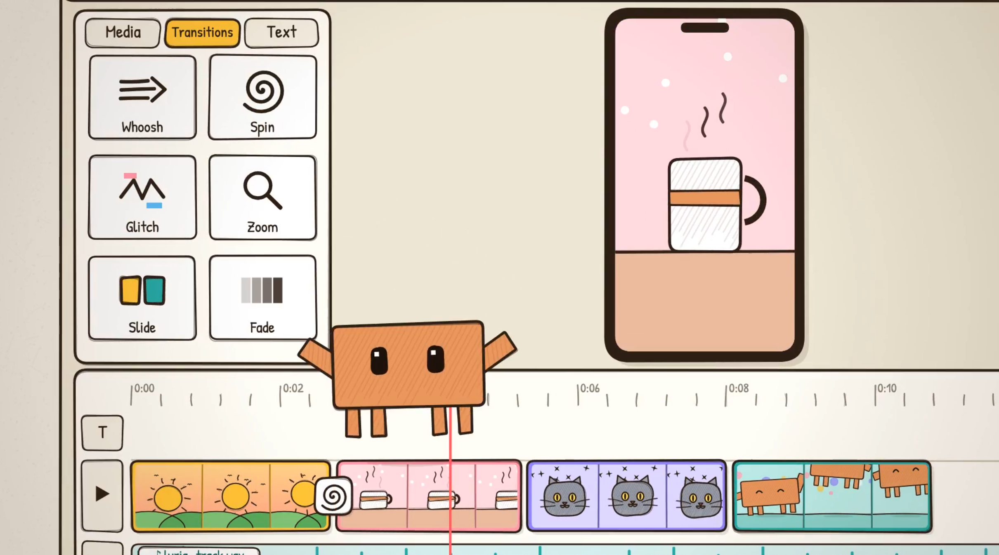
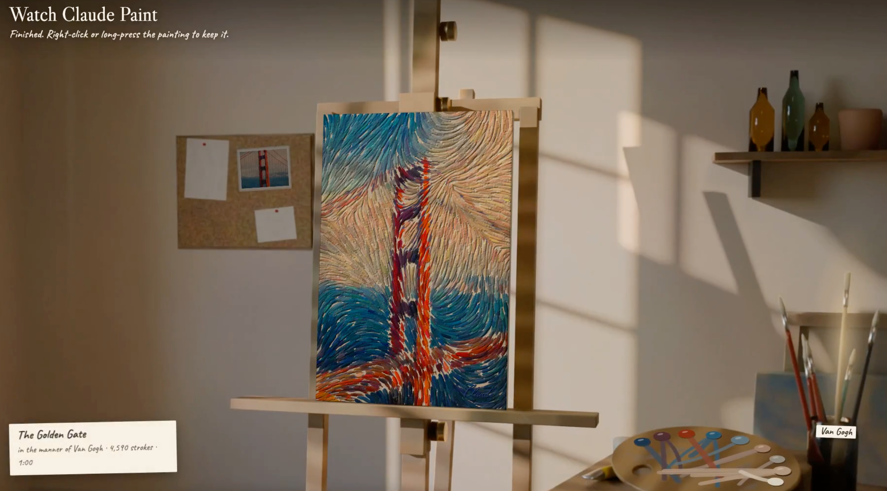
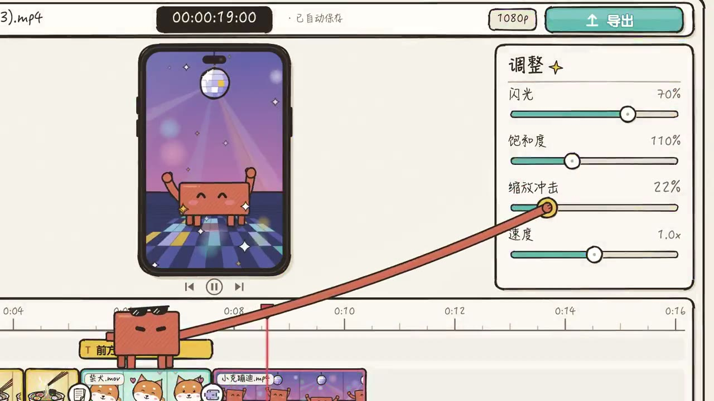
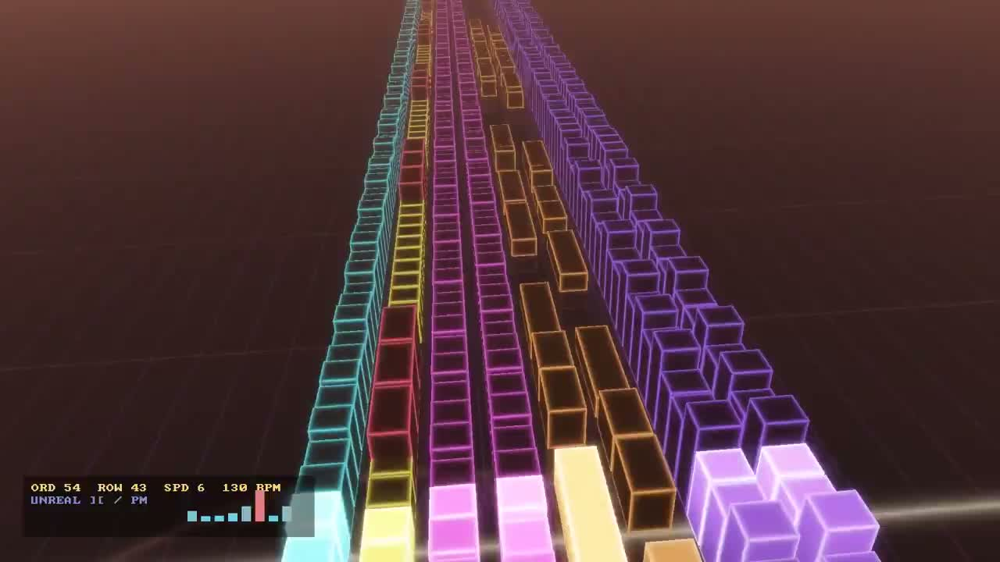
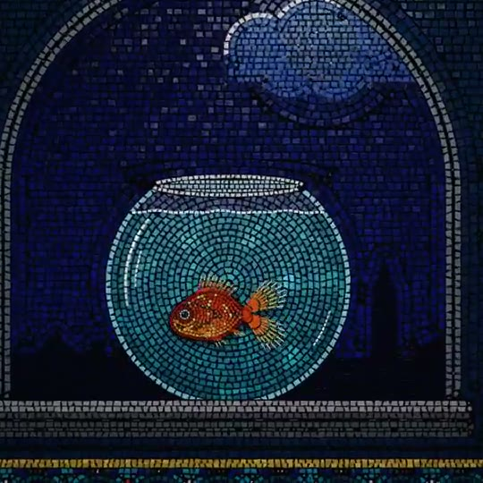

# 代码动画与视觉实验

[English](code-animation.md) | **简体中文**

[返回首页](../README.zh-CN.md)

共 25 个案例。

## 作品预览

<table>
<tr>
<td width="33%" valign="top" align="center"> <strong><a href="#case-2102681172367323300">Claude 的卡通剪辑台</a></strong> <a href="https://x.com/NFT_Chen">SuSu_酥酥 @NFT_Chen</a></td>
<td width="33%" valign="top" align="center"> <strong><a href="#case-2102501773705670994">Steam Song（交互式定格动画）</a></strong> <a href="https://x.com/chetaslua">Chetaslua @chetaslua</a></td>
<td width="33%" valign="top" align="center"> <strong><a href="#case-2102482039522107417">One Suit, Six Toons（六种卡通世界）</a></strong> <a href="https://x.com/chetaslua">Chetaslua @chetaslua</a></td>
</tr>
<tr>
<td width="33%" valign="top" align="center"> <strong><a href="#case-2102436464323661880">DreW 的代码动画实验</a></strong> <a href="https://x.com/devteamdrew">@devteamdrew</a></td>
<td width="33%" valign="top" align="center"> <strong><a href="#case-2102445641205248145">Sketch-to-simulation</a></strong> <a href="https://x.com/poolio">Ben Poole @poolio</a></td>
<td width="33%" valign="top" align="center"> <strong><a href="#case-2102515055116063144">宇宙像素疾走</a></strong> <a href="https://x.com/riku720720">Rikuo @riku720720</a></td>
</tr>
<tr>
<td width="33%" valign="top" align="center"> <strong><a href="#case-2102717687604633959">浏览器里的骑行</a></strong> <a href="https://x.com/prasenx">@prasenx</a></td>
<td width="33%" valign="top" align="center"> <strong><a href="#case-2102849349122470205">Watch Claude Paint</a></strong> <a href="https://x.com/petergyang">Peter Yang @petergyang</a></td>
<td width="33%" valign="top" align="center"> <strong><a href="#case-2102493303388475855">Oktoberfest</a></strong> <a href="https://x.com/cherry_mx_reds">Tak @cherry_mx_reds</a></td>
</tr>
<tr>
<td width="33%" valign="top" align="center"> <strong><a href="#case-2103033624463585327">鹈鹕骑行 SVG 动画</a></strong> <a href="https://x.com/shitunote">马识途 @shitunote</a></td>
<td width="33%" valign="top" align="center"> <strong><a href="#case-2102733714845491558">Opus 5.5 两分钟有声动画</a></strong> <a href="https://x.com/dhruvalgolakiya">Dhruval @dhruvalgolakiya</a></td>
<td width="33%" valign="top" align="center"> <strong><a href="#case-2102746041250705890">Opus 像素场景实验</a></strong> <a href="https://x.com/HugoDuprez">Hugo Duprez @HugoDuprez</a></td>
</tr>
<tr>
<td width="33%" valign="top" align="center"> <strong><a href="#case-2102478640428773861">Opus 5.5 想象攻克难题</a></strong> <a href="https://x.com/chetaslua">Chetaslua @chetaslua</a></td>
<td width="33%" valign="top" align="center"> <strong><a href="#case-2102707412704919910">程序绘制的像素奔马</a></strong> <a href="https://x.com/victormustar">Victor M @victormustar</a></td>
<td width="33%" valign="top" align="center"> <strong><a href="#case-2102893186330841502">Opus 5.5 Demoscene 开场动画</a></strong> <a href="https://x.com/JustinPerea">Justin.md @JustinPerea</a></td>
</tr>
<tr>
<td width="33%" valign="top" align="center"> <strong><a href="#case-2102865596480409849">DreW 代码动画续作</a></strong> <a href="https://x.com/devteamdrew">DreW @devteamdrew</a></td>
<td width="33%" valign="top" align="center"> <strong><a href="#case-2102888874858959029">Claude 5.5 像素动画续作</a></strong> <a href="https://x.com/SpikeRiser">R @SpikeRiser</a></td>
<td width="33%" valign="top" align="center"> <strong><a href="#case-2103031723428917626">中文版卡通剪辑台</a></strong> <a href="https://x.com/dashiAIxz">发布者：大师的AI小灶 @dashiAIxz</a></td>
</tr>
<tr>
<td width="33%" valign="top" align="center"> <strong><a href="#case-2103124033365762215">列车窗外的四季</a></strong> <a href="https://x.com/itsolelehmann">Ole Lehmann @itsolelehmann</a></td>
<td width="33%" valign="top" align="center"> <strong><a href="#case-2102919394775220530">90 年代风格 Demoscene</a></strong> <a href="https://x.com/gandamu_ml">gandamu @gandamu_ml</a></td>
<td width="33%" valign="top" align="center"> <strong><a href="#case-2103039181266338276">极限乐理音画实验</a></strong> <a href="https://x.com/dadabots">dadabots @dadabots</a></td>
</tr>
<tr>
<td width="33%" valign="top" align="center"> <strong><a href="#case-2102503027340988559">玻璃与金箔马赛克</a></strong> <a href="https://x.com/LCSlates">Chris Riley @LCSlates</a></td>
<td width="33%" valign="top" align="center"> <strong><a href="#case-2102472218269900876">Sweet Tooth</a></strong> <a href="https://x.com/cherry_mx_reds">Tak @cherry_mx_reds</a></td>
<td width="33%" valign="top" align="center"> <strong><a href="#case-2102796895982878850">有声像素场景</a></strong> <a href="https://x.com/peekcell">Peekcell @peekcell</a></td>
</tr>
<tr>
<td width="33%" valign="top" align="center"> <strong><a href="#case-2102436001473786054">13,081 块拼片的马赛克动画</a></strong> <a href="https://x.com/dfeinition">Dan Fein @dfeinition</a></td>
<td width="33%" valign="top"></td>
<td width="33%" valign="top"></td>
</tr>
</table>

## 案例详情

### 极限乐理音画实验

- **作者**：[dadabots @dadabots](https://x.com/dadabots)
- **样片**：[观看 24 秒视频](https://x.com/dadabots/status/2103039181266338276)
- **原帖**：[查看作者原帖](https://x.com/dadabots/status/2103039181266338276)
- **内容**：以密集的和弦、音名和乐理术语构成动画，并与声音同步的音画实验。
- **实现**：作者称 Opus 5.5 编写全部 JavaScript，画面和声音都由代码生成，没有使用采样或外部库。
- **提示词**：原帖只概述了让模型创作复杂乐理作品的要求，没有公开完整原文。

### 90 年代风格 Demoscene

- **作者**：[gandamu @gandamu_ml](https://x.com/gandamu_ml)
- **样片**：[观看约 6 分钟演示](https://x.com/gandamu_ml/status/2102919394775220530)
- **原帖**：[查看作者原帖](https://x.com/gandamu_ml/status/2102919394775220530)
- **内容**：受 1990 年代 demoscene 启发，连续展示几何特效、文字与 3D 动画。
- **实现**：作者称 Opus 5.5 根据一条提示词，使用 C/C++ 和 OpenGL 完成作品。配乐由作者提供，是 Purple Motion 为 *Second Reality* 创作的音乐，并非 Opus 5.5 生成。
- **提示词**：作者确认只用了一条提示词，但没有公开原文。

### 列车窗外的四季

- **作者**：[Ole Lehmann @itsolelehmann](https://x.com/itsolelehmann)
- **样片**：[观看 30 秒短片](https://x.com/itsolelehmann/status/2103124033365762215)
- **原帖**：[查看作者原帖](https://x.com/itsolelehmann/status/2103124033365762215)
- **内容**：舒适的车厢里放着一杯咖啡，车窗外的景色依次经过四季。
- **实现**：作者称 Opus 5.5 在 Claude Code 中独立完成，未使用其他 AI 工具或参考图片；它编写约 2,800 行代码，绘制 900 帧画面并程序合成配乐。原帖还介绍了分层视差、检查静帧和四季转场的过程，但未说明绘图软件名称。
- **提示词**：作者在[原帖](https://x.com/itsolelehmann/status/2103124033365762215)公开的单条提示词原文：

> 4 seasons passing outside a train window, a cozy carriage, a cup of coffee on the table, Grand Budapest Hotel style

### 中文版卡通剪辑台

- **发布者**：[大师的AI小灶 @dashiAIxz](https://x.com/dashiAIxz)；帖子未明确说明视频制作者。
- **样片**：[观看 30 秒视频](https://x.com/dashiAIxz/status/2103031723428917626)
- **原帖**：[查看发布者帖子](https://x.com/dashiAIxz/status/2103031723428917626)
- **内容**：中文版卡通剪辑台动画，角色在时间轴上编排片段，并通过手机画面预览。
- **实现**：发布者提及 Opus 5.5，但没有说明具体制作方法或技术栈。帖子引用了[此前的卡通剪辑台动画](https://x.com/NFT_Chen/status/2102681172367323300)，本条视频的画面与其不同。
- **提示词**：未公开。

### Claude 5.5 像素动画续作

- **作者**：[R @SpikeRiser](https://x.com/SpikeRiser)
- **样片**：[观看视频](https://x.com/SpikeRiser/status/2102888874858959029)
- **原帖**：[查看作者原帖](https://x.com/SpikeRiser/status/2102888874858959029)
- **内容**：作者继续发布的像素风动画。
- **实现**：作者称使用 Claude 5.5 制作像素画；这条帖子未明确模型子版本或制作技术栈。
- **提示词**：未公开。

### Claude 的卡通剪辑台

- **作者**：[SuSu_酥酥 @NFT_Chen](https://x.com/NFT_Chen)
- **样片**：[观看 30 秒动画](https://x.com/NFT_Chen/status/2102681172367323300)
- **原帖**：[查看作者原帖](https://x.com/NFT_Chen/status/2102681172367323300)
- **内容**：Claude 角色站在时间轴上，把日出、咖啡、猫和跳舞片段拖进卡通剪辑台；画面展示转场、波形、参数滑块与手机预览框。
- **实现**：作者称不使用视频生成模型，由 Opus 5.5 用程序绘制剪辑台与动画画面；原帖未公开代码或具体技术栈。
- **提示词**：原帖未公开制作提示词。

### Steam Song（交互式定格动画）

- **作者**：[Chetaslua @chetaslua](https://x.com/chetaslua)
- **样片**：[观看 10 秒视频](https://x.com/chetaslua/status/2102501773705670994) · [在线体验与源码](https://codepen.io/editor/ChetasLua/pen/01a0cadf-5b81-756f-8647-8cf5a47e7adf)
- **原帖**：[查看作者原帖](https://x.com/chetaslua/status/2102501773705670994)
- **内容**：杯中蒸汽化作音符，牵出鸟群、花瓣与女孩的短片；在线版支持点击、拖动和逐帧播放。
- **实现**：作者称由 Opus 5.5 编写代码完成，未使用外部素材、MCP 或 Skill；CodePen 公开了 HTML、CSS 和 JavaScript 源码。
- **提示词**：原帖未公开制作提示词。

### One Suit, Six Toons（六种卡通世界）

- **作者**：[Chetaslua @chetaslua](https://x.com/chetaslua)
- **样片**：[观看约 47 秒演示](https://x.com/chetaslua/status/2102482039522107417)
- **原帖**：[查看作者原帖](https://x.com/chetaslua/status/2102482039522107417)
- **内容**：同一角色以六种卡通风格呈现；演示画面提示可拖动头像、点击进入相应场景。
- **实现**：作者称使用 Opus 5.5，以 JavaScript 代码生成画面和音乐；原帖未提供源码或在线体验地址。
- **提示词**：原帖未公开制作提示词。

### 玻璃与金箔马赛克

- **作者**：[Chris Riley @LCSlates](https://x.com/LCSlates)
- **样片**：[观看 80 秒短片](https://x.com/LCSlates/status/2102503027340988559)
- **原帖**：[查看作者原帖](https://x.com/LCSlates/status/2102503027340988559)
- **内容**：金箔马赛克墙的砖片翻飞，组成鱼、飞鸟和星群，再从夜色中回到白昼。
- **实现**：作者称使用 Opus 5.5 制作；提示词要求以 WebGL2 和原生 JavaScript 写成单个 HTML 文件，不用库或图片、字体、音频文件。[agent 过程记录](https://x.com/LCSlates/status/2102503030469833168)称声音由浏览器合成，并列出逐帧检查后的修改。
- **提示词**：[作者公开的片段](https://x.com/LCSlates/status/2102503028859211905)。该回复在句中结束，未见完整原文。

> Make an 80 second square animated film as a single HTML file, using WebGL2 and plain JavaScript, with no libraries and no image, font or audio files. It should look like a glass and gold leaf wall mosaic whose tiles were never glued down, so they can lift, flip, fly and click back into place.

### 13,081 块拼片的马赛克动画

- **作者**：[Dan Fein @dfeinition](https://x.com/dfeinition)
- **样片**：[观看 80 秒视频](https://x.com/dfeinition/status/2102436001473786054)
- **原帖**：[查看作者原帖](https://x.com/dfeinition/status/2102436001473786054)
- **内容**：方屏马赛克动画以鱼缸为中心，星光的倒影变成 22 条小鱼。
- **实现**：作者称使用 Opus 5.5 以代码绘制并动画化 13,081 块马赛克拼片，没有使用图片文件；原帖未说明具体技术栈或制作耗时。
- **提示词**：原帖未公开制作提示词。

### DreW 的代码动画实验

- **作者**：[@devteamdrew](https://x.com/devteamdrew)
- **样片**：[观看视频](https://x.com/devteamdrew/status/2102436464323661880) · [续作](https://x.com/devteamdrew/status/2102865596480409849)
- **原帖**：[查看作者原帖](https://x.com/devteamdrew/status/2102436464323661880)
- **实现**：作者称整段动画由 Claude 写代码完成，使用 [Claude Code CLI](https://x.com/devteamdrew/status/2102462935390171162)；[参考了以前的视频](https://x.com/devteamdrew/status/2102455479196676488)，[配乐迭代了 3～4 次](https://x.com/devteamdrew/status/2102462675821179295)。
- **提示词**：未见公开的完整原文。

### Sketch-to-simulation

- **作者**：[Ben Poole @poolio](https://x.com/poolio)
- **样片**：[观看视频](https://x.com/poolio/status/2102445641205248145)
- **原帖**：[查看作者原帖](https://x.com/poolio/status/2102445641205248145)
- **内容**：将草图转为动态模拟的视觉实验。
- **实现**：作者注明使用 Opus 5.5；原帖未说明具体技术栈。
- **提示词**：原帖正文未附提示词。

### Sweet Tooth

- **作者**：[Tak @cherry_mx_reds](https://x.com/cherry_mx_reds)
- **样片**：[观看视频](https://x.com/cherry_mx_reds/status/2102472218269900876)
- **原帖**：[查看作者原帖](https://x.com/cherry_mx_reds/status/2102472218269900876)
- **制作耗时**：18 分 31 秒
- **实现**：作者称使用 Opus 5.5 一次生成这段动画；原帖未说明具体技术栈。
- **提示词**：原帖正文未附提示词。

### 宇宙像素疾走

- **作者**：[Rikuo @riku720720](https://x.com/riku720720)
- **样片**：[观看视频](https://x.com/riku720720/status/2102515055116063144)
- **原帖**：[查看作者原帖](https://x.com/riku720720/status/2102515055116063144)
- **制作耗时**：不到 5 分钟
- **实现**：作者称 Opus 5.5 完成这段像素动画；提示词要求使用 Vanilla JavaScript、Canvas 2D 和单个自包含 HTML 文件，不使用外部素材、库或网络请求。
- **提示词**：[作者公开的完整日文原文](https://x.com/riku720720/status/2102515058010132554)。详细规定了 160×90 逻辑画布、固定调色板、障碍与回避动作、状态机、粒子效果和无缝循环；[作者说明](https://x.com/riku720720/status/2102542979160592728)这份提示词参考了另一作品的提示词。

> Vanilla JavaScript と Canvas 2D を使い、オレンジ色のピクセルキャラクターが宇宙空間のレインボーの床を超高速で駆け抜け、次々と襲いかかる隕石やビームをかっこよく回避し続けるアニメーションを、単一の自己完結型 HTML ファイルとして作成してください。外部アセット、ライブラリ、ネットワークリクエストは一切使用しないこと。操作は不要で、キャラクターが自動で回避し続けるデモとしてシームレスにループさせること。

### 浏览器里的骑行

- **作者**：[@prasenx](https://x.com/prasenx)
- **样片**：[观看演示视频](https://x.com/prasenx/status/2102717687604633959)
- **原帖**：[查看作者原帖](https://x.com/prasenx/status/2102717687604633959)
- **实现**：作者称使用 Opus 5.5 制作浏览器中的骑行场景；树木与声音均由代码生成，没有下载素材。
- **提示词**：原帖正文未附提示词。

### Watch Claude Paint

- **作者**：[Peter Yang @petergyang](https://x.com/petergyang)
- **样片**：[观看 30 秒演示](https://x.com/petergyang/status/2102849349122470205) · [在线体验](https://claude.ai/artifact/9sZD4wrf1MpWACjg83hK4r)
- **原帖**：[查看作者原帖](https://x.com/petergyang/status/2102849349122470205)
- **内容**：上传照片后，观看 Claude 以莫奈、梵高等画风逐步绘画。
- **实现**：作者称这是使用 Opus 5.5 制作的交互应用；原帖未说明绘制代码或图像处理的具体实现。
- **教程**：[观看制作过程](https://www.youtube.com/watch?v=UhBqorWNwlU)
- **提示词**：原帖未公开制作提示词。

### Oktoberfest

- **作者**：[Tak @cherry_mx_reds](https://x.com/cherry_mx_reds)
- **样片**：[观看 30 秒动画](https://x.com/cherry_mx_reds/status/2102493303388475855)
- **原帖**：[查看作者原帖](https://x.com/cherry_mx_reds/status/2102493303388475855)
- **制作耗时**：14 分 48 秒
- **内容**：以 Oktoberfest（啤酒节）为题的动画。
- **实现**：作者称使用 Opus 5.5 一次生成；原帖未说明具体技术栈。
- **提示词**：原帖称制作方法在下方回复，但正文未公开提示词原文，回复内容待核对。

### 有声像素场景

- **作者**：[Peekcell @peekcell](https://x.com/peekcell)
- **样片**：[观看约 15 秒演示](https://x.com/peekcell/status/2102796895982878850)
- **原帖**：[查看作者原帖](https://x.com/peekcell/status/2102796895982878850)
- **内容**：带声音的像素风场景动画。
- **实现**：作者称使用 Opus 5.5 生成；原帖未说明具体制作工具或代码实现。
- **提示词**：原帖称提示词在下方回复，原文待核对。

### 鹈鹕骑行 SVG 动画

- **作者**：[马识途 @shitunote](https://x.com/shitunote)
- **样片**：[观看约 20 秒动画](https://x.com/shitunote/status/2103033624463585327)
- **原帖**：[查看作者原帖](https://x.com/shitunote/status/2103033624463585327)
- **内容**：鹈鹕骑自行车并奔跑的动画，用于比较不同提示词的效果。
- **实现**：作者称使用 Opus 5.5；提示词要求制作 SVG 动画并在 H5 页面展示，原帖未公开代码供核对。
- **提示词**：[作者公开的本次实验提示词](https://x.com/shitunote/status/2103033624463585327)：

> 生成一个鹈鹕骑自行车的svg动画，以H5页面展示

作者还转述另一段 3D 鹈鹕视频的提示词为“生成鹈鹕骑单车3D页面，尽情发挥”；这不是本案例的提示词，且尚未得到那段视频原作者核实。

### Opus 5.5 两分钟有声动画

- **作者**：[Dhruval @dhruvalgolakiya](https://x.com/dhruvalgolakiya)
- **样片**：[观看约 2 分 4 秒视频](https://x.com/dhruvalgolakiya/status/2102733714845491558)
- **原帖**：[查看作者原帖](https://x.com/dhruvalgolakiya/status/2102733714845491558)
- **制作耗时**：约 2 小时
- **成本**：作者称消耗约 5,600 万 tokens，按 API 价格估算约 68 美元。
- **实现**：作者称使用 Opus 5.5 制作，视频包含音频和音效；原帖未说明具体画面或声音技术栈。
- **相关**：[作者此前的短片演示](https://x.com/dhruvalgolakiya/status/2102484620109644273)
- **提示词**：作者称用了 3 条提示词，原帖未公开原文。

### Opus 像素场景实验

- **作者**：[Hugo Duprez @HugoDuprez](https://x.com/HugoDuprez)
- **样片**：[观看约 13 秒演示](https://x.com/HugoDuprez/status/2102746041250705890)
- **原帖**：[查看作者原帖](https://x.com/HugoDuprez/status/2102746041250705890)
- **内容**：像素风场景动画。
- **实现**：作者称使用 Opus 5.5 生成；原帖未说明具体技术栈或素材来源。
- **提示词**：原帖未公开制作提示词。

### Opus 5.5 想象攻克难题

- **作者**：[Chetaslua @chetaslua](https://x.com/chetaslua)
- **样片**：[观看 30 秒视频](https://x.com/chetaslua/status/2102478640428773861)
- **原帖**：[查看作者原帖](https://x.com/chetaslua/status/2102478640428773861)
- **内容**：以 Opus 5.5 想象解决难题为主题的动画。
- **实现**：作者称作品由 Claude Opus 5.5 完全用代码制作；原帖未说明具体动画技术栈。
- **提示词**：原帖未公开制作提示词。

### 程序绘制的像素奔马

- **作者**：[Victor M @victormustar](https://x.com/victormustar)
- **样片**：[观看 10 秒视频](https://x.com/victormustar/status/2102707412704919910)
- **原帖**：[查看作者原帖](https://x.com/victormustar/status/2102707412704919910)
- **内容**：一匹以 128 × 96 像素画面逐帧程序绘制的奔马。
- **实现**：作者称 Opus 5.5 制作了单文件 HTML，使用原生 JavaScript 和 Canvas 2D，没有图片或库；马腿关节由逆向运动学驱动，奔跑循环包含 12 个姿态。
- **提示词**：原帖未公开制作提示词。

### Opus 5.5 Demoscene 开场动画

- **作者**：[Justin.md @JustinPerea](https://x.com/JustinPerea)
- **样片**：[观看 43 秒视频](https://x.com/JustinPerea/status/2102893186330841502)
- **原帖**：[查看作者原帖](https://x.com/JustinPerea/status/2102893186330841502)
- **制作耗时**：作者称约 5 小时。
- **内容**：展示 Opus 5.5 能力的视听 demoscene 开场动画。
- **实现**：作者称全部画面与声音来自一个 280 KB 的 HTML 文件，未使用图片、音频文件、3D 模型或库；原帖报告消耗 6.97 亿 token，未说明统计口径。
- **提示词**：作者概述了“让 Opus 5.5 尽可能精彩地展示自己、不给更多方向”的要求，未公开提示词原文。

### DreW 代码动画续作

- **作者**：[DreW @devteamdrew](https://x.com/devteamdrew)
- **样片**：[观看 32 秒视频](https://x.com/devteamdrew/status/2102865596480409849)
- **原帖**：[查看作者原帖](https://x.com/devteamdrew/status/2102865596480409849)
- **关联作品**：[第一段动画](code-animation.zh-CN.md#case-2102436464323661880)
- **实现**：作者将这段视频标为 Part 2，并注明使用 Claude Opus 5.5；原帖未说明此段的具体制作流程。
- **提示词**：原帖未公开制作提示词。

[返回首页](../README.zh-CN.md)
