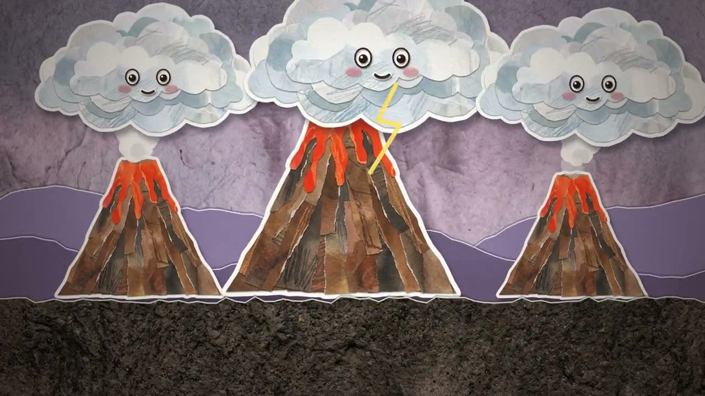

# Explainers & Information Visualization

**English** | [简体中文](explainers.zh-CN.md)

[Back to home](../README.md)

9 cases.

## Previews

<table>
<tr>
<td width="33%" valign="top" align="center"> <strong><a href="#case-2102779758408774104">Proton Collisions at the Large Hadron Collider</a></strong> <a href="https://x.com/superalesha">Alexey Fateev @superalesha</a></td>
<td width="33%" valign="top" align="center"> <strong><a href="#case-2102737776219168939">Pixel Neural Network Training</a></strong> <a href="https://x.com/DotCSV">Carlos Santana @DotCSV</a></td>
<td width="33%" valign="top" align="center"> <strong><a href="#case-2102844654169575547">AI History: From Attention Is All You Need to AGI</a></strong> <a href="https://x.com/kimmonismus">@kimmonismus</a></td>
</tr>
<tr>
<td width="33%" valign="top" align="center"> <strong><a href="#case-2102591147927654847">The Plane of Focus</a></strong> <a href="https://x.com/RyanSael">Ryan Sael @RyanSael</a></td>
<td width="33%" valign="top" align="center"> <strong><a href="#case-2102463796149440888">History of Claude Models</a></strong> <a href="https://x.com/superalesha">Alexey Fateev @superalesha</a></td>
<td width="33%" valign="top" align="center"> <strong><a href="#case-2103009037164110327">How Browsers Work in 40 Seconds</a></strong> <a href="https://x.com/addyosmani">Addy Osmani @addyosmani</a></td>
</tr>
<tr>
<td width="33%" valign="top" align="center"> <strong><a href="#case-2102583898865873225">Five Millennia of Chinese History</a></strong> <a href="https://x.com/akokoi1">WY @akokoi1</a></td>
<td width="33%" valign="top" align="center"> <strong><a href="#case-2102987981695132140">The Steep Part: The Next 50 Years of AI</a></strong> <a href="https://x.com/andrewjiang">Andrew Jiang @andrewjiang</a></td>
<td width="33%" valign="top" align="center"> <strong><a href="#case-2103087123503177752">How the World Was Made</a></strong> <a href="https://x.com/Iamshankhadeep">Shankhadeep Dey @Iamshankhadeep</a></td>
</tr>
</table>

## Case Details

### How the World Was Made

- **Creator:** [Shankhadeep Dey @Iamshankhadeep](https://x.com/Iamshankhadeep)
- **Watch:** [Watch the 60-second video](https://x.com/Iamshankhadeep/status/2103087123503177752)
- **Original post:** [Creator's post](https://x.com/Iamshankhadeep/status/2103087123503177752)
- **About:** An illustrated story of Earth's formation, from a young planet and collisions to volcanoes, oceans, and life.
- **Implementation:** The creator credits Opus 5.5, but does not describe the animation stack or production workflow.
- **Prompt:** The post describes the topic as "how the world is formed," but does not publish the full prompt.

### The Steep Part: The Next 50 Years of AI

- **Creator:** [Andrew Jiang @andrewjiang](https://x.com/andrewjiang)
- **Watch:** [Watch the four-minute video](https://x.com/andrewjiang/status/2102987981695132140)
- **Original post:** [Creator's post](https://x.com/andrewjiang/status/2102987981695132140)
- **About:** An illustrated forecast of AI's next 50 years. The creator describes a difficult transition but an optimistic destination.
- **Implementation:** The creator says Opus 5.5 made the video; the post does not disclose the animation stack or production workflow.
- **Prompt:** The post describes the task as predicting the next 50 years, but does not publish the full prompt.

### Proton Collisions at the Large Hadron Collider

- **Creator:** [Alexey Fateev @superalesha](https://x.com/superalesha)
- **Watch:** [Watch video](https://x.com/superalesha/status/2102779758408774104)
- **Original post:** [Creator's post](https://x.com/superalesha/status/2102779758408774104)
- **About:** A camera move through the LHC magnet tunnel into the detector, ending with a proton collision and particle tracks.
- **Implementation:** The creator says Opus 5.5 generated geometry, materials, camera moves, and sound in Blender through code, without premade assets; particle tracks were calculated from the detector's magnetic field.
- **Prompt:** The task was summarized in the post, but the full prompt is not public.

### Pixel Neural Network Training

- **Creator:** [Carlos Santana @DotCSV](https://x.com/DotCSV)
- **Watch:** [Watch video](https://x.com/DotCSV/status/2102737776219168939)
- **Original post:** [Creator's post](https://x.com/DotCSV/status/2102737776219168939)
- **About:** A pixel animation explaining how a neural network trains.
- **Implementation:** The creator says Opus 5.5 made the animation and also trained a network on MNIST to make the depicted process more accurate. The animation stack was not disclosed.
- **Prompt:** The task was summarized in the post, but the full prompt is not public.

### AI History: From Attention Is All You Need to AGI

- **Creator:** [@kimmonismus](https://x.com/kimmonismus)
- **Watch:** [Watch video](https://x.com/kimmonismus/status/2102844654169575547)
- **Original post:** [Creator's post](https://x.com/kimmonismus/status/2102844654169575547)
- **About:** A three-minute account of AI history from the landmark paper to AGI.
- **Implementation:** The creator says Opus 5.5 in Claude Code produced about 7,400 lines of React, TypeScript, and Remotion. SVG and Canvas draw the visuals; open-source TTS supplies narration and Python synthesizes the score. No stock footage or image generator was used.
- **Prompt:** The post describes the task but does not publish the full prompt.

### The Plane of Focus

- **Creator:** [Ryan Sael @RyanSael](https://x.com/RyanSael)
- **Watch:** [Watch video](https://x.com/RyanSael/status/2102591147927654847) · [Live demo](https://lens.lab.sael.net)
- **Original post:** [Creator's post](https://x.com/RyanSael/status/2102591147927654847)
- **Production time:** 1 hour 26 minutes; reported API cost: $25.66.
- **About:** An interactive lens experiment: change focus distance and aperture to see how light paths and the sharp plane change.
- **Implementation:** The creator says Opus 5.5 completed it in one pass. The post does not specify the implementation stack.
- **Prompt:** The task was summarized in the post, but the full prompt is not public.

### History of Claude Models

- **Creator:** [Alexey Fateev @superalesha](https://x.com/superalesha)
- **Watch:** [Watch video](https://x.com/superalesha/status/2102463796149440888)
- **Original post:** [Creator's post](https://x.com/superalesha/status/2102463796149440888)
- **About:** An animated timeline of the Claude model family.
- **Implementation:** The creator says Opus 5.5 made it with pure JavaScript and a custom hand-drawn Canvas animation skill.
- **Prompt:** The post describes the topic but does not publish the full prompt.

### How Browsers Work in 40 Seconds

- **Creator:** [Addy Osmani @addyosmani](https://x.com/addyosmani)
- **Watch:** [Watch 40-second video](https://x.com/addyosmani/status/2103009037164110327)
- **Original post:** [Creator's post](https://x.com/addyosmani/status/2103009037164110327)
- **About:** A short animated explanation of how browsers work.
- **Implementation:** The creator says Claude Opus 5.5 drew every frame in JavaScript. The post does not give a more detailed workflow or stack.
- **Prompt:** Not public.

### Five Millennia of Chinese History

- **Creator:** [WY @akokoi1](https://x.com/akokoi1)
- **Watch:** [Watch 2-minute-38-second video](https://x.com/akokoi1/status/2102583898865873225)
- **Original post:** [Creator's post](https://x.com/akokoi1/status/2102583898865873225)
- **About:** A rapid animated survey of five millennia of Chinese history, without narration.
- **Implementation:** The creator says Claude Opus 5.5 made the video but does not specify the visual stack. They suggest a TTS API could add narration; none was used for this version.
- **Usage:** On a Max (5x) subscription, the creator reports using 3% of the five-hour allowance and 1% of the weekly allowance. This is quota usage, not production time.
- **Prompt:** Not public.

[Back to home](../README.md)
