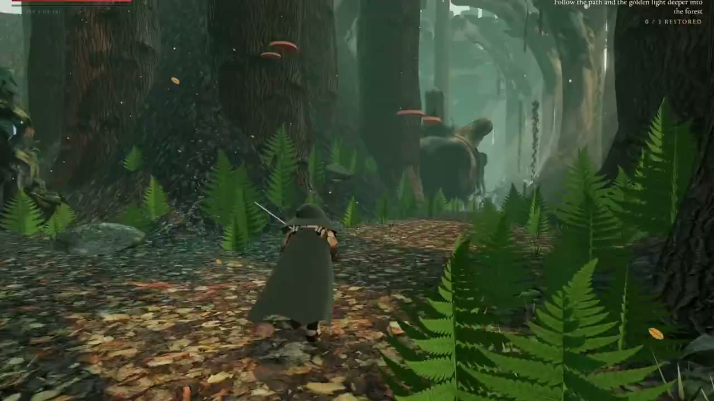

# Games & Playable Animation

**English** | [简体中文](games.zh-CN.md)

[Back to home](../README.md)

23 cases (two creator attributions remain unverified).

## Previews

<table>
<tr>
<td width="33%" valign="top" align="center"> <strong><a href="#case-2102656878035759230">Open-World RPG Grasslands</a></strong> <a href="https://x.com/uchita_success">うちた @uchita_success</a></td>
<td width="33%" valign="top" align="center"> <strong><a href="#case-2102834362530079093">Arkenfall</a></strong> <a href="https://x.com/LexnLin">Leon Lin @LexnLin</a></td>
<td width="33%" valign="top" align="center"> <strong><a href="#case-2102865595675050010">Pixel Shanghai: Alley Radio</a></strong> <a href="https://x.com/ring_hyacinth">Ring Hyacinth @ring_hyacinth</a></td>
</tr>
<tr>
<td width="33%" valign="top" align="center"> <strong><a href="#case-2102831012686573744">Stickman Game</a></strong> <a href="https://x.com/notjazii">J A Z I I @notjazii</a></td>
<td width="33%" valign="top" align="center"> <strong><a href="#case-2102801635638673762">Rainy Pixel Ruins</a></strong> <a href="https://x.com/KanaWorks_AI">KANA @KanaWorks_AI</a></td>
<td width="33%" valign="top" align="center"> <strong><a href="#case-2102608618751508947">Cycling Pelican (Attribution Unverified)</a></strong> <a href="https://x.com/alin_zone">Showcased by @alin_zone</a></td>
</tr>
<tr>
<td width="33%" valign="top" align="center"> <strong><a href="#case-2102588571442188577">Three.js 3D Game Demo</a></strong> <a href="https://x.com/xikhar">Shikhar @xikhar</a></td>
<td width="33%" valign="top" align="center"> <strong><a href="#case-2102794467032154206">Code-Generated 2D Pixel Game Scene</a></strong> <a href="https://x.com/rehan_shei">Rehan Sheikh @rehan_shei</a></td>
<td width="33%" valign="top" align="center"> <strong><a href="#case-2102874271316078841">Open-World Multiplayer New York</a></strong> <a href="https://x.com/mattshumer_">Matt Shumer @mattshumer_</a></td>
</tr>
<tr>
<td width="33%" valign="top" align="center"> <strong><a href="#case-2102440678282412195">Dark Souls-style Game Demo</a></strong> <a href="https://x.com/The_Alex">Alex @The_Alex</a></td>
<td width="33%" valign="top" align="center"> <strong><a href="#case-2102862008467194151">Nested-World Multiplayer Heist</a></strong> <a href="https://x.com/jsnnsa">jacob @jsnnsa</a></td>
<td width="33%" valign="top" align="center"> <strong><a href="#case-2102773498037023140">Harpoon Fishing Game</a></strong> <a href="https://x.com/nachat_dayo">なちゃっと @nachat_dayo</a></td>
</tr>
<tr>
<td width="33%" valign="top" align="center"> <strong><a href="#case-2102463453176979794">Antikythera Mechanism Game</a></strong> <a href="https://x.com/edwinarbus">edwin @edwinarbus</a></td>
<td width="33%" valign="top" align="center"> <strong><a href="#case-2102513817855094922">Multiplayer Lawn-Mowing Simulator</a></strong> <a href="https://x.com/_MaxBlade">Max Blade @_MaxBlade</a></td>
<td width="33%" valign="top" align="center"> <strong><a href="#case-2102476490344730950">Code-Drawn Beekeeping Game</a></strong> <a href="https://x.com/oguzthedev">Oguz @oguzthedev</a></td>
</tr>
<tr>
<td width="33%" valign="top" align="center"> <strong><a href="#case-2102932763750084797">Three.js Symbiote Game Update</a></strong> <a href="https://x.com/xikhar">Shikhar @xikhar</a></td>
<td width="33%" valign="top" align="center"> <strong><a href="#case-2103004432786993341">Cozy Fishing Game</a></strong> <a href="https://x.com/dangreenheck">Dan Greenheck @dangreenheck</a></td>
<td width="33%" valign="top" align="center"> <strong><a href="#case-2103009665177305456">Abacus AI 3D Game Showcase</a></strong> <a href="https://x.com/bindureddy">Showcased by Bindu Reddy @bindureddy</a></td>
</tr>
<tr>
<td width="33%" valign="top" align="center"> <strong><a href="#case-2102461886247948571">Browser Minecraft</a></strong> <a href="https://x.com/buildwithsid">siddharth @buildwithsid</a></td>
<td width="33%" valign="top" align="center"> <strong><a href="#case-2102502712621531543">One-Shot Game Demo</a></strong> <a href="https://x.com/inlovewithgo">Shubham @inlovewithgo</a></td>
<td width="33%" valign="top" align="center"> <strong><a href="#case-2102828630615421223">Splatoon-Style Game</a></strong> <a href="https://x.com/JaydenDavisNC">Jayden Davis @JaydenDavisNC</a></td>
</tr>
<tr>
<td width="33%" valign="top" align="center"> <strong><a href="#case-2103043212869026013">Genshin-Inspired Godot Game</a></strong> <a href="https://x.com/IHayato">イケハヤ @IHayato</a></td>
<td width="33%" valign="top" align="center"> <strong><a href="#case-2103138051165933661">Unreal ARPG Prototype</a></strong> <a href="https://x.com/KanaWorks_AI">KANA @KanaWorks_AI</a></td>
<td width="33%" valign="top"></td>
</tr>
</table>

## Case Details

### Unreal ARPG Prototype

- **Creator:** [KANA @KanaWorks_AI](https://x.com/KanaWorks_AI)
- **Watch:** [Watch the 51-second demo](https://x.com/KanaWorks_AI/status/2103138051165933661)
- **Original post:** [Creator's post](https://x.com/KanaWorks_AI/status/2103138051165933661)
- **About:** A controller-driven action RPG prototype in a snowy arena. The creator demonstrates running, rolling, and swinging a sword.
- **Implementation:** The creator credits Claude Opus 5.5 and Unreal Engine. The post does not detail the development process or provide a playable build.
- **Prompt:** Not public.

### Genshin-Inspired Godot Game

- **Creator:** [イケハヤ @IHayato](https://x.com/IHayato)
- **Watch:** [Watch the 69-second demo](https://x.com/IHayato/status/2103043212869026013)
- **Original post:** [Creator's post](https://x.com/IHayato/status/2103043212869026013)
- **About:** A third-person game prototype with a character moving through grassy terrain, bridges, and hills. The creator says it still has a long way to go before reaching Genshin Impact's level.
- **Implementation:** The creator says Opus 5.5 made the prototype in Godot; the post gives no further production details or playable link.
- **Prompt:** The creator quotes the request 「原神クラスのゲームを作って」 ("Make a Genshin Impact-class game"). The post does not include a fuller prompt or session transcript.

### Browser Minecraft

- **Creator:** [siddharth @buildwithsid](https://x.com/buildwithsid)
- **Watch:** [Watch video](https://x.com/buildwithsid/status/2102461886247948571) · [Live demo](https://minecraft-iota-coral.vercel.app/)
- **Original post:** [Creator's post](https://x.com/buildwithsid/status/2102461886247948571)
- **About:** A Minecraft-like game running in the browser.
- **Implementation:** The creator says Opus 5.5 made it. The post does not explain the technical stack or asset sources.
- **Prompt:** Not public.

### One-Shot Game Demo

- **Creator:** [Shubham @inlovewithgo](https://x.com/inlovewithgo)
- **Watch:** [Watch video](https://x.com/inlovewithgo/status/2102502712621531543)
- **Original post:** [Creator's post](https://x.com/inlovewithgo/status/2102502712621531543)
- **About:** A game demonstration shared as a short screen recording.
- **Implementation:** The creator says Opus 5.5 made the game in one shot. The post gives no stack or playable URL.
- **Prompt:** Not public.

### Splatoon-Style Game

- **Creator:** [Jayden Davis @JaydenDavisNC](https://x.com/JaydenDavisNC)
- **Watch:** [Watch video](https://x.com/JaydenDavisNC/status/2102828630615421223)
- **Original post:** [Creator's post](https://x.com/JaydenDavisNC/status/2102828630615421223)
- **About:** A nearly polished game inspired by Splatoon.
- **Implementation:** The creator says Opus 5.5 made it from one prompt. The post does not disclose the stack, assets, or a playable URL.
- **Prompt:** The full prompt is not public.

### Open-World RPG Grasslands

- **Creator:** [うちた @uchita_success](https://x.com/uchita_success)
- **Watch:** [Watch video](https://x.com/uchita_success/status/2102656878035759230)
- **Original post:** [Creator's post](https://x.com/uchita_success/status/2102656878035759230)
- **Production time:** About 15 minutes.
- **About:** A controllable adventurer crosses grasslands toward lakes, towns, and snowy mountains, and can summon a horse.
- **Implementation:** The creator says Opus 5.5 made a roughly 3,031-line single HTML file. It loads only Three.js and fonts externally; terrain, grass, characters, horse, interface, and sound are generated in code.
- **Prompt:** The creator published a summary of the initial request and one follow-up, not a complete session transcript.

[Production notes](https://x.com/uchita_success/status/2102675203591688376).

> Opus5.5の実力をゲーム作りで見せたい
> RPGのハイクオリティなワールドを、長旅してる冒険者風の主人公が歩いたり走ったりする。自分で操作できればよい

### Arkenfall

- **Creator:** [Leon Lin @LexnLin](https://x.com/LexnLin)
- **Watch:** [Watch video](https://x.com/LexnLin/status/2102834362530079093) · [More footage](https://x.com/LexnLin/status/2102837750001233989) · [Live demo](https://arkenfall.site/)
- **Original post:** [Creator's post](https://x.com/LexnLin/status/2102834362530079093)
- **About:** A playable browser-based open world with terrain, creatures, combat, a boss fight, sound, and music.
- **Implementation:** The creator says Opus 5.5 coded the game, edited the trailer, and made the score. A separate image model generated the trailer cover.
- **Prompt:** Not public.

### Pixel Shanghai: Alley Radio

- **Creator:** [Ring Hyacinth @ring_hyacinth](https://x.com/ring_hyacinth)
- **Watch:** [Watch video](https://x.com/ring_hyacinth/status/2102865595675050010) · [Live demo](https://ringhyacinth.github.io/hyacinth.im-site/pixel-shanghai/)
- **Original post:** [Creator's post](https://x.com/ring_hyacinth/status/2102865595675050010)
- **About:** Xiaoman explores pixel-art Shanghai and collects memories of the city.
- **Implementation:** The creator says Opus 5.5 adapted an existing short film into a game in one pass. Existing pixel animation became the scenery, Nano Banana Pro generated characters and maps, and the browser synthesizes music and sound.
- **Prompt:** The adaptation task is described, but the full prompt is not public.

Based on the [2025 Pixel Shanghai short](https://x.com/ring_hyacinth/status/1912363356679545252). The live demo also credits Mouse for game production.

### Stickman Game

- **Creator:** [J A Z I I @notjazii](https://x.com/notjazii)
- **Watch:** [Watch video](https://x.com/notjazii/status/2102831012686573744) · [Live demo](https://stickman-opus-5-5-game.vercel.app/)
- **Original post:** [Creator's post](https://x.com/notjazii/status/2102831012686573744)
- **About:** A playable game with customizable stickman characters and multiple skills.
- **Implementation:** The creator says Opus 5.5 made this game; its stack was not specified. An earlier stickman animation mentioned a single HTML file and JavaScript, but that is a separate work.
- **Prompt:** Not public.

### Rainy Pixel Ruins

- **Creator:** [KANA @KanaWorks_AI](https://x.com/KanaWorks_AI)
- **Watch:** [Watch video](https://x.com/KanaWorks_AI/status/2102801635638673762)
- **Original post:** [Creator's post](https://x.com/KanaWorks_AI/status/2102801635638673762)
- **About:** A 2.5D pixel courtyard in the rain, where travelers, a merchant, and a camel gather at a fire. The player can add wood and inspect a shop.
- **Implementation:** The creator says Opus 5.5 combined pixel art with volumetric lighting. The technical stack and a playable URL were not published.
- **Prompt:** Not public.

### Cycling Pelican (Attribution Unverified)

- **Creator:** Unverified. [@alin_zone](https://x.com/alin_zone) showcased the animation but did not identify themselves as its creator.
- **Watch:** [Watch video](https://x.com/alin_zone/status/2102608618751508947)
- **Showcase post:** [View post](https://x.com/alin_zone/status/2102608618751508947)
- **About:** A cycling-pelican animation; the showcase post says a live version exists.
- **Implementation:** The showcase post attributes it to Opus 5.5 and mentions cinematic camera movement. The stack and original creator's post remain unverified.
- **Prompt:** Not public in the showcase post.

A [different author's SVG/H5 prompt experiment](code-animation.md#case-2103033624463585327) is a separate work.

### Antikythera Mechanism Game

- **Creator:** [edwin @edwinarbus](https://x.com/edwinarbus)
- **Watch:** [Watch video](https://x.com/edwinarbus/status/2102463453176979794)
- **Original post:** [Creator's post](https://x.com/edwinarbus/status/2102463453176979794)
- **About:** A playable game inspired by the discovery of the Antikythera mechanism.
- **Implementation:** The creator says Opus 5.5 wrote the code; visuals and sound are generated at runtime in a single HTML file of about 3 MB. A playable Claude Artifact was reportedly linked in a reply, but its direct URL has not been verified.
- **Prompt:** The theme is described, but the full prompt is not public.

### Three.js 3D Game Demo

- **Creator:** [Shikhar @xikhar](https://x.com/xikhar)
- **Watch:** [Watch video](https://x.com/xikhar/status/2102588571442188577)
- **Original post:** [Creator's post](https://x.com/xikhar/status/2102588571442188577)
- **Implementation:** The creator says Opus 5.5 Medium built a Three.js game and made its 3D models, textures, and animation from scratch. More workflow details were not published.
- **Prompt:** Not public.
- **Follow-up:** [Symbiote suit and gameplay update](games.md#case-2102932763750084797).

### Three.js Symbiote Game Update

- **Creator:** [Shikhar @xikhar](https://x.com/xikhar)
- **Watch:** [Watch 130-second video](https://x.com/xikhar/status/2102932763750084797)
- **Original post:** [Creator's post](https://x.com/xikhar/status/2102932763750084797)
- **About:** After several iterations, the game adds a symbiote suit, improved animations and models, and gameplay mechanics. The creator says the city overhaul is still in progress.
- **Implementation:** The creator says this Opus 5.5 Medium project was built from scratch with Three.js and Blender.
- **Prompt:** Not public.
- **Earlier demo:** [Three.js 3D Game Demo](games.md#case-2102588571442188577).

### Cozy Fishing Game

- **Creator:** [Dan Greenheck @dangreenheck](https://x.com/dangreenheck)
- **Watch:** [Watch the 4-minute-52-second video](https://x.com/dangreenheck/status/2103004432786993341) · [Play the game](https://dgreenheck.github.io/tidewater/)
- **Original post:** [Creator's post](https://x.com/dangreenheck/status/2103004432786993341)
- **About:** The creator turned his coastal demo into a fishing game: catch fish, sell them to Joe, and buy tackle and boat parts from Marta at the boathouse.
- **Implementation:** The creator says Opus 5.5 iterated on the environments, plants, models, and graphics, adding wear to the scene. The game now uses native WebGPU. An optimization pass raised performance from 60 to 100 FPS before new features used most of that gain.
- **Prompt:** Not public.
- **Earlier work:** [Interactive Island Ecosystem](3d-scenes.md#case-2102878170089169235).

### Abacus AI 3D Game Showcase

- **Showcased by:** [Bindu Reddy @bindureddy](https://x.com/bindureddy); the post does not name an individual game creator.
- **Watch:** [Watch the 67-second video](https://x.com/bindureddy/status/2103009665177305456)
- **Original post:** [View post](https://x.com/bindureddy/status/2103009665177305456)
- **About:** An Abacus AI Supercomputer demonstration showing a *Shattered Titans* title screen and third-person 3D gameplay in forest and futuristic settings.
- **Implementation:** The post presents Opus 5.5 as the game-building model. It also advertises multiplayer levels, virtual goods and payments, messaging, voice chat, and a free backend as platform capabilities; the video does not establish that every feature is present in the shown game.
- **Prompt:** The video shows the opening of the request below; the full prompt and production time are not public.

> Build a premium, playable third-person action-adventure game using Opus 5.5 and Blender and 3D Games skill, called **SHATTERED TITANS**. The player enters an impossible ancient realm grown around the corpse of a colossal fallen god and must recover three memories that have been captured and corrupted by creatures living inside the god's fractured consciousness.

### Code-Generated 2D Pixel Game Scene

- **Creator:** [Rehan Sheikh @rehan_shei](https://x.com/rehan_shei)
- **Watch:** [Watch video](https://x.com/rehan_shei/status/2102794467032154206)
- **Original post:** [Creator's post](https://x.com/rehan_shei/status/2102794467032154206)
- **About:** A 2D pixel game-style animation; the post does not confirm that it is playable.
- **Implementation:** The creator says Opus 5.5 generated the visuals in code. The exact stack was not disclosed.
- **Prompt:** The creator references [Majid Manzarpour's post](https://x.com/majidmanzarpour/status/2102476258948927543) as the prompt source, but the original prompt text has not been verified.

### Open-World Multiplayer New York

- **Creator:** [Matt Shumer @mattshumer_](https://x.com/mattshumer_)
- **Watch:** [Watch video](https://x.com/mattshumer_/status/2102874271316078841) · [Live demo](https://somethingbig.ai/world/)
- **Original post:** [Creator's post](https://x.com/mattshumer_/status/2102874271316078841)
- **Production time:** The creator said Opus 5.5 had been iterating for almost a day when the post was published.
- **About:** An open-world multiplayer game set in New York.
- **Implementation:** The creator says Opus 5.5 continued improving the game; the post does not identify the game stack.
- **Prompt:** Not public.

### Dark Souls-style Game Demo

- **Creator:** [Alex @The_Alex](https://x.com/The_Alex)
- **Watch:** [Watch video](https://x.com/The_Alex/status/2102440678282412195)
- **Original post:** [Creator's post](https://x.com/The_Alex/status/2102440678282412195)
- **About:** The creator introduced this as a Dark Souls-style work; gameplay details and a playable link were not published.
- **Implementation:** The creator says it was made during early access to Opus 5.5. The stack was not disclosed.
- **Prompt:** Not public.

### Nested-World Multiplayer Heist

- **Creator:** [jacob @jsnnsa](https://x.com/jsnnsa)
- **Watch:** [Watch video](https://x.com/jsnnsa/status/2102862008467194151)
- **Original post:** [Creator's post](https://x.com/jsnnsa/status/2102862008467194151)
- **Production time:** The creator says 26 Opus 5.5 agents worked through the night; no precise duration was given.
- **About:** A multiplayer heist across five nested worlds, with tabletop go-karts, pursuing robots, and contested loot.
- **Implementation:** The creator says the game is playable, but the post does not provide a direct link or technical stack.
- **Prompt:** Not public.

### Harpoon Fishing Game

- **Creator:** [なちゃっと @nachat_dayo](https://x.com/nachat_dayo)
- **Watch:** [Watch video](https://x.com/nachat_dayo/status/2102773498037023140) · [Live demo](https://claude.ai/artifact/X7xKcMxVJjjoCZ9ZSYyFUa)
- **Original post:** [Creator's post](https://x.com/nachat_dayo/status/2102773498037023140)
- **About:** A playable harpoon-fishing game.
- **Implementation:** The creator says Opus 5.5 produced most of it after one prompt, with later fixes and polish. It used about 16% of a ¥3,000 plan allowance; the technical stack was not disclosed.
- **Prompt:** The initial prompt text is not public.

### Multiplayer Lawn-Mowing Simulator

- **Creator:** [Max Blade @_MaxBlade](https://x.com/_MaxBlade)
- **Watch:** [Watch 37-second video](https://x.com/_MaxBlade/status/2102513817855094922)
- **Original post:** [Creator's post](https://x.com/_MaxBlade/status/2102513817855094922)
- **About:** A multiplayer lawn-mowing simulator that the creator describes as featuring beer and cigars.
- **Implementation:** The creator says Opus 5.5 built the game and that they ran it live on their server for chat participants to join. The post does not provide a public play link or technical stack.
- **Prompt:** Not public.

### Code-Drawn Beekeeping Game

- **Creator:** [Oguz @oguzthedev](https://x.com/oguzthedev)
- **Watch:** [Watch 34-second video](https://x.com/oguzthedev/status/2102476490344730950)
- **Original post:** [Creator's post](https://x.com/oguzthedev/status/2102476490344730950)
- **About:** A beekeeping game where players plant flowers, bees fly, and a small beekeeper walks and harvests honey.
- **Implementation:** The creator says Claude Opus 5.5 made the game from a single prompt. Hives, flowers, bees, and the beekeeper are drawn entirely in code, with no image files; the exact stack was not disclosed.
- **Prompt:** The post summarizes the request as a beekeeping game, but does not publish the exact prompt text.

[Back to home](../README.md)
