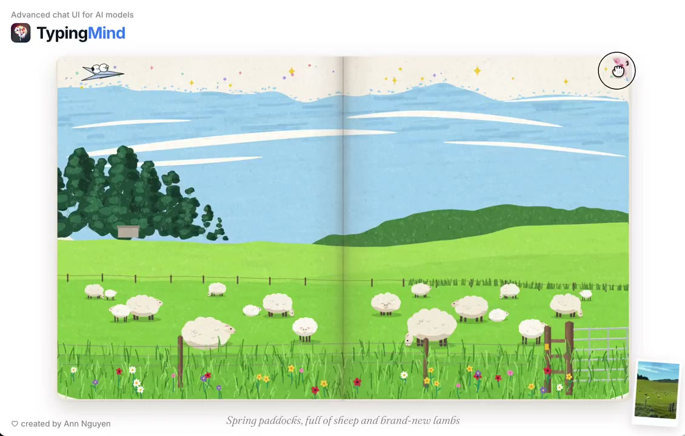
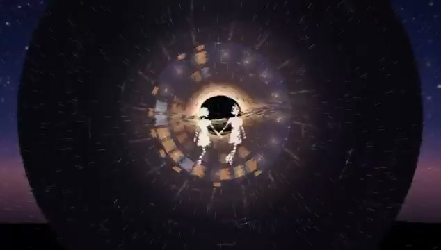

# Hand-Drawn Animation & Music Videos

**English** | [简体中文](hand-drawn-mv.zh-CN.md)

[Back to home](../README.md)

9 cases.

## Previews

<table>
<tr>
<td width="33%" valign="top" align="center"> <strong><a href="#case-2102457111787745405">Frame-by-Frame Coastal Drawing</a></strong> <a href="https://x.com/strawhatsu4">Hunter Su @strawhatsu4</a></td>
<td width="33%" valign="top" align="center"> <strong><a href="#case-2102986085328716066">Mid-Autumn Collage Animation</a></strong> <a href="https://x.com/ring_hyacinth">Ring Hyacinth @ring_hyacinth</a></td>
<td width="33%" valign="top" align="center"> <strong><a href="#case-2102610626321490404">Functional Emotions Music Video</a></strong> <a href="https://x.com/eudaemonea">josh @eudaemonea</a></td>
</tr>
<tr>
<td width="33%" valign="top" align="center"> <strong><a href="#case-2102592355165782312">250 Years of U.S. History in Sand Animation</a></strong> <a href="https://x.com/Michaelzsguo">Michael Guo @Michaelzsguo</a></td>
<td width="33%" valign="top" align="center"> <strong><a href="#case-2102801274173587569">Claude Pop Remake Music Video</a></strong> <a href="https://x.com/donaldjewkes">donald @donaldjewkes</a></td>
<td width="33%" valign="top" align="center"> <strong><a href="#case-2102573127192727704">New Zealand Acrylic-Style Travel Album</a></strong> <a href="https://x.com/ann_nnng">Ann Nguyen @ann_nnng</a></td>
</tr>
<tr>
<td width="33%" valign="top" align="center"> <strong><a href="#case-2102711467191775625">City Windows and Starfield Music Video</a></strong> <a href="https://x.com/FKR_Icarus">Posted by Ica.G @FKR_Icarus</a></td>
<td width="33%" valign="top" align="center"> <strong><a href="#case-2103033635397898433">Painted Rick Astley Dance</a></strong> <a href="https://x.com/petergostev">Peter Gostev @petergostev</a></td>
<td width="33%" valign="top"></td>
</tr>
<tr>
<td width="33%" valign="top" align="center"> <strong><a href="#case-2102878288008057171">Opus Self-Portraits and Piano</a></strong> <a href="https://x.com/kevin_t_ngo">Kevin Ngo @kevin_t_ngo</a></td>
<td width="33%" valign="top"></td>
<td width="33%" valign="top"></td>
</tr>
</table>

## Case Details

### Painted Rick Astley Dance

- **Creator:** [Peter Gostev @petergostev](https://x.com/petergostev)
- **Watch:** [Watch the one-minute animation](https://x.com/petergostev/status/2103033635397898433) · [Source code](https://github.com/petergpt/painted-rickroll)
- **Original post:** [Creator's post](https://x.com/petergostev/status/2103033635397898433)
- **About:** Rick Astley's dance reimagined as moving painterly brushstrokes synchronized to music.
- **Implementation:** The [published prompt](https://x.com/petergostev/status/2103082371570340234) asks Opus 5.5 to draw the visuals and music in code as an HTML animation without external media.
- **Prompt:** The creator published the full prompt in a [reply](https://x.com/petergostev/status/2103082371570340234):

> Recreate Rick Astley’s unmistakable dance as an HTML animation about one minute long, made from bold, moving brushstrokes and synced to music. His coat, microphone, and shadows should swing with exaggerated rhythm. Make it a piece of art: artistic, beautiful, polished and incredibly fun and approximately 1m long. Draw everything in code, including the music; no external media or website UI.

### Opus Self-Portraits and Piano

- **Creator:** [Kevin Ngo @kevin_t_ngo](https://x.com/kevin_t_ngo)
- **Watch:** [Watch the 20-second video](https://x.com/kevin_t_ngo/status/2102878288008057171)
- **Original post:** [Creator's post](https://x.com/kevin_t_ngo/status/2102878288008057171)
- **About:** A sequence of self-portraits set to a piano score.
- **Implementation:** The creator says Claude Opus 5.5 drew the portraits in JavaScript and composed the piano music. Other production details were not disclosed.
- **Prompt:** Not public.

### Frame-by-Frame Coastal Drawing

- **Creator:** [Hunter Su @strawhatsu4](https://x.com/strawhatsu4)
- **Watch:** [Watch video](https://x.com/strawhatsu4/status/2102457111787745405)
- **Original post:** [Creator's post](https://x.com/strawhatsu4/status/2102457111787745405)
- **About:** A blank page becomes a coastline sketch and then a colored seascape.
- **Implementation:** The creator says Opus 5.5 drew the frames in JavaScript. No code or detailed workflow was published.
- **Prompt:** Not public.

The video thumbnail supplied by X is the blank opening frame; open the post to see the drawing unfold.

### New Zealand Acrylic-Style Travel Album

- **Creator:** [Ann Nguyen @ann_nnng](https://x.com/ann_nnng)
- **Watch:** [Watch the 22-second video](https://x.com/ann_nnng/status/2102573127192727704)
- **Original post:** [Creator's post](https://x.com/ann_nnng/status/2102573127192727704)
- **About:** A page-turning illustrated album based on the creator's New Zealand trip photos, showing landscapes and travel moments in an acrylic-painting style.
- **Implementation:** The creator says Opus 5.5 drew the pictures entirely in JavaScript. The post does not identify the graphics library or publish the source code.
- **Prompt:** The post summarizes the request as drawing her New Zealand trip photos in acrylic style; the exact prompt and production time are not public.

### Mid-Autumn Collage Animation

- **Creator:** [Ring Hyacinth @ring_hyacinth](https://x.com/ring_hyacinth)
- **Watch:** [Watch video](https://x.com/ring_hyacinth/status/2102986085328716066)
- **Original post:** [Creator's post](https://x.com/ring_hyacinth/status/2102986085328716066)
- **About:** A collage-style Mid-Autumn Festival short.
- **Implementation:** The creator supplied the script and music. Opus 5.5 drew frames in JavaScript with p5.js and p5.brush textures, and a Node.js program assembled sound effects. Nano Banana Pro supplied background drafts and paper textures.
- **Prompt:** Not public.

### Functional Emotions Music Video

- **Creator:** [josh @eudaemonea](https://x.com/eudaemonea)
- **Watch:** [Watch video](https://x.com/eudaemonea/status/2102610626321490404)
- **Original post:** [Creator's post](https://x.com/eudaemonea/status/2102610626321490404)
- **About:** An animated video for a song inspired by Anthropic's Functional Emotions paper.
- **Implementation:** The creator says Opus 5.5 made the video for an existing song. In a reply, he attributes the lyrics to Opus 4.6 and the song to Suno. The video's technical stack was not disclosed.
- **Prompt:** The post describes the task but does not publish the full video prompt.

### 250 Years of U.S. History in Sand Animation

- **Creator:** [Michael Guo @Michaelzsguo](https://x.com/Michaelzsguo)
- **Watch:** [Watch video](https://x.com/Michaelzsguo/status/2102592355165782312)
- **Original post:** [Creator's post](https://x.com/Michaelzsguo/status/2102592355165782312)
- **About:** A two-minute sand animation with narration, effects, and music.
- **Implementation:** The creator says Opus 5.5 made it from one prompt without Blender or Three.js. Music was produced with Python/mido MIDI and rendered through FluidSynth with FluidR3.
- **Prompt:** The creator published the prompt.

> Make a 2-minute sand animation that tells the story of 250 years of U.S. history. Keep it lively, engaging, and tasteful. Add appropriate background music and sound design.

### Claude Pop Remake Music Video

- **Creator:** [donald @donaldjewkes](https://x.com/donaldjewkes)
- **Watch:** [Watch video](https://x.com/donaldjewkes/status/2102801274173587569)
- **Original post:** [Creator's post](https://x.com/donaldjewkes/status/2102801274173587569)
- **Production time:** About 12 hours of model work.
- **About:** A new music video built on the original Claude Pop track.
- **Implementation:** The creator says Opus 5.5 worked from a spoken prompt with access to Seedance 2.5, ElevenLabs, reference assets, and the earlier code repository. This is a mixed-tool production, not a pure-JavaScript or asset-free video.
- **Prompt:** The [full prompt](https://x.com/donaldjewkes/status/2102801469976248500) is public. It calls for a new video on the original soundtrack, with repeated checks of framing, lyrics, and final output.

The [original video](https://x.com/slimer48484/status/2097752569212756134) predates Opus 5.5. This entry covers the remake.

### City Windows and Starfield Music Video

- **Posted by:** [Ica.G @FKR_Icarus](https://x.com/FKR_Icarus). The post does not explicitly identify the human creator of the visuals.
- **Watch:** [Watch the 4-minute-45-second video](https://x.com/FKR_Icarus/status/2102711467191775625)
- **Original post:** [View post](https://x.com/FKR_Icarus/status/2102711467191775625)
- **About:** Two luminous figures move among apartment windows, meet beneath an eclipse-like opening, and drift into a starfield.
- **Implementation:** The post says Opus 5.5 made the visuals entirely in code and the song was made with Suno. The code, exact stack, and production time were not published.
- **Prompt:** Not public.

[Back to home](../README.md)
