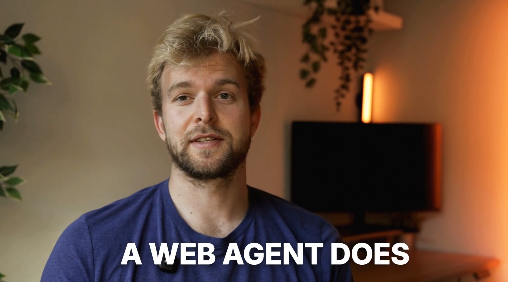
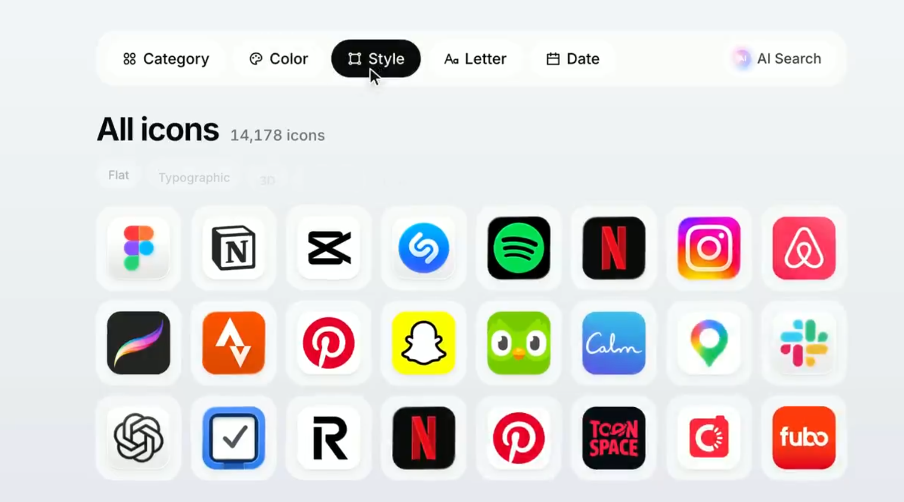
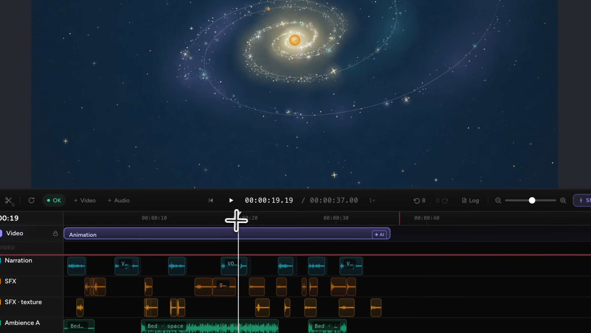
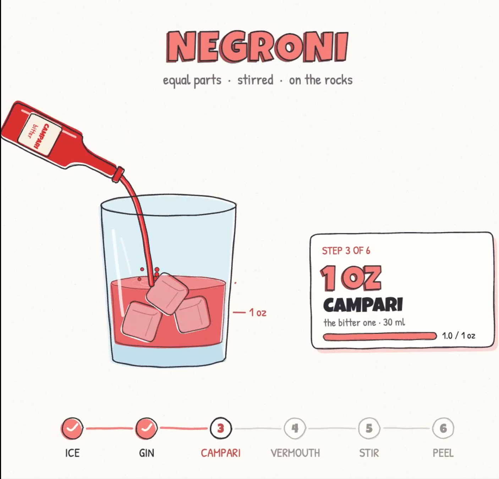

# Motion & Brand Design

**English** | [简体中文](motion-design.zh-CN.md)

[Back to home](../README.md)

7 cases.

## Previews

<table>
<tr>
<td width="33%" valign="top" align="center"> <strong><a href="#case-2102984873351037161">video-use Launch Video</a></strong> <a href="https://x.com/gregpr07">Gregor Zunic @gregpr07</a></td>
<td width="33%" valign="top" align="center"> <strong><a href="#case-2102621064518160485">Applore Product Promo</a></strong> <a href="https://x.com/decohack">viggo @decohack</a></td>
<td width="33%" valign="top" align="center"> <strong><a href="#case-2102498682931441977">CoAnimator Animation Experiment</a></strong> <a href="https://x.com/rege_dev">rege @rege_dev</a></td>
</tr>
<tr>
<td width="33%" valign="top" align="center"> <strong><a href="#case-2102666619029999989">AI Employees Motion Video</a></strong> <a href="https://x.com/chhddavid">David Ch @chhddavid</a></td>
<td width="33%" valign="top"></td>
<td width="33%" valign="top"></td>
</tr>
<tr>
<td width="33%" valign="top" align="center"> <strong><a href="#case-2102853258582880547">Cocktail Recipe Motion Graphic</a></strong> <a href="https://x.com/Ror_Fly">Rory Flynn @Ror_Fly</a></td>
<td width="33%" valign="top" align="center"> <strong><a href="#case-2102789774461280370">Opus 5.5 vs GPT-6 Astra Loss Screen</a></strong> <a href="https://x.com/developedbyed">Dev Ed @developedbyed</a></td>
<td width="33%" valign="top"></td>
</tr>
<tr>
<td width="33%" valign="top" align="center"> <strong><a href="#case-2102757164158689759">JavaScript-Drawn Vertical Ad</a></strong> <a href="https://x.com/Lucas_IA_">Lucas | Ecom IA @Lucas_IA_</a></td>
<td width="33%" valign="top"></td>
<td width="33%" valign="top"></td>
</tr>
</table>

## Case Details

### video-use Launch Video

- **Creator:** [Gregor Zunic @gregpr07](https://x.com/gregpr07)
- **Watch:** [Watch video](https://x.com/gregpr07/status/2102984873351037161)
- **Original post:** [Creator's post](https://x.com/gregpr07/status/2102984873351037161)
- **Production time:** The spoken segment took about two minutes to process; total production time was not disclosed.
- **About:** A launch short assembled from 13 takes of a human talking-head recording.
- **Implementation:** The creator says Opus 5.5 used video-use to inspect transcripts and frames, select takes, correct subtitles, grade footage, and package the final video. The spoken-segment processing cost $0.90.
- **Prompt:** The post lists the steps, but not the exact prompt text.

### Applore Product Promo

- **Creator:** [viggo @decohack](https://x.com/decohack)
- **Watch:** [Watch video](https://x.com/decohack/status/2102621064518160485) · [Live demo](https://applore.app/)
- **Original post:** [Creator's post](https://x.com/decohack/status/2102621064518160485)
- **Production time:** A few minutes, according to the creator.
- **About:** A promotional video built around Applore's brand mark and app icons.
- **Implementation:** The creator says Opus 5.5 made the video; the post does not identify the full stack or asset sources.
- **Prompt:** Not public.

### JavaScript-Drawn Vertical Ad

- **Creator:** [Lucas | Ecom IA @Lucas_IA_](https://x.com/Lucas_IA_)
- **Watch:** [Watch video](https://x.com/Lucas_IA_/status/2102757164158689759)
- **Original post:** [Creator's post](https://x.com/Lucas_IA_/status/2102757164158689759)
- **About:** A vertical ad with line-drawn animation.
- **Implementation:** The creator says Opus 5.5 in Claude Code drew the visuals in JavaScript and ElevenLabs provided narration. Image/video-generation cost was reported as $0, excluding Claude Code tokens and voice synthesis.
- **Prompt:** Not public.

### Cocktail Recipe Motion Graphic

- **Creator:** [Rory Flynn @Ror_Fly](https://x.com/Ror_Fly)
- **Watch:** [Watch video](https://x.com/Ror_Fly/status/2102853258582880547)
- **Original post:** [Creator's post](https://x.com/Ror_Fly/status/2102853258582880547)
- **About:** A recipe explainer that follows the drink from empty glass to completion, showing ingredients and measures as they are added.
- **Implementation:** The creator says Opus 5.5 used an image reference to build the animation in HTML. The reference image was not separately published.
- **Prompt:** The creator published the prompt in the original post. It depends on a supplied recipe image, so the text alone cannot reproduce the same result.

> We're going to try a little test. Do you think you could render a recipe motion graphic animation using javascript or html (w/e you think will produce the best) to show the full recipe from start to finish (empty glass to completed cocktail) - Explainer video style - Showing the recipe ingreidents + measurements as they're going into the cup. Should be a 30s video.

### CoAnimator Animation Experiment

- **Creator:** [rege @rege_dev](https://x.com/rege_dev)
- **Watch:** [Watch video](https://x.com/rege_dev/status/2102498682931441977)
- **Original post:** [Creator's post](https://x.com/rege_dev/status/2102498682931441977)
- **About:** A demonstration of animation, timeline editing, sound effects, and ambient sound.
- **Implementation:** The creator says it was made with Opus 5.5 and the CoAnimator app over several prompts. The exact animation stack was not disclosed.
- **Prompt:** Not public.

### Opus 5.5 vs GPT-6 Astra Loss Screen

- **Creator:** [Dev Ed @developedbyed](https://x.com/developedbyed)
- **Watch:** [Watch video](https://x.com/developedbyed/status/2102789774461280370)
- **Original post:** [Creator's post](https://x.com/developedbyed/status/2102789774461280370)
- **About:** A short loss-screen animation comparison between Opus 5.5 and GPT-6 Astra.
- **Implementation:** The post names the two models but does not explain their respective roles, tools, or workflow.
- **Prompt:** Not public.

### AI Employees Motion Video

- **Creator:** [David Ch @chhddavid](https://x.com/chhddavid)
- **Watch:** [Watch 50-second video](https://x.com/chhddavid/status/2102666619029999989)
- **Original post:** [Creator's post](https://x.com/chhddavid/status/2102666619029999989)
- **Production time:** 19 minutes, according to the creator.
- **About:** A motion-design video whose cover introduces AI Employees roles including engineer, copywriter, designer, and marketing.
- **Implementation:** The creator says Opus 5.5 generated the video with only two changes. The post does not describe the animation stack or asset sources.
- **Prompt:** Not public.

[Back to home](../README.md)
