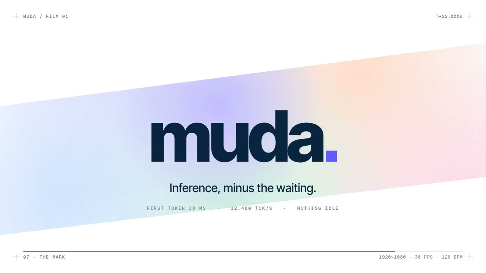

# 动效与品牌设计

[English](motion-design.md) | **简体中文**

[返回首页](../README.zh-CN.md)

共 8 个案例。

## 作品预览

<table>
<tr>
<td width="33%" valign="top" align="center"> <strong><a href="#case-2102984873351037161">video-use 发布短片</a></strong> <a href="https://x.com/gregpr07">Gregor Zunic @gregpr07</a></td>
<td width="33%" valign="top" align="center"> <strong><a href="#case-2102621064518160485">Applore 产品宣传片</a></strong> <a href="https://x.com/decohack">viggo @decohack</a></td>
<td width="33%" valign="top" align="center"> <strong><a href="#case-2102498682931441977">CoAnimator 动画实验</a></strong> <a href="https://x.com/rege_dev">rege @rege_dev</a></td>
</tr>
<tr>
<td width="33%" valign="top" align="center"> <strong><a href="#case-2102666619029999989">AI Employees 品牌动效</a></strong> <a href="https://x.com/chhddavid">David Ch @chhddavid</a></td>
<td width="33%" valign="top" align="center"> <strong><a href="#case-2102787937482252537">muda. 推理服务发布短片</a></strong> <a href="https://x.com/deedydas">Deedy @deedydas</a></td>
<td width="33%" valign="top"></td>
</tr>
<tr>
<td width="33%" valign="top" align="center"> <strong><a href="#case-2102853258582880547">鸡尾酒配方动效</a></strong> <a href="https://x.com/Ror_Fly">Rory Flynn @Ror_Fly</a></td>
<td width="33%" valign="top" align="center"> <strong><a href="#case-2102789774461280370">Opus 5.5 与 GPT-6 Astra 失败界面动效</a></strong> <a href="https://x.com/developedbyed">Dev Ed @developedbyed</a></td>
<td width="33%" valign="top"></td>
</tr>
<tr>
<td width="33%" valign="top" align="center"> <strong><a href="#case-2102757164158689759">JavaScript 绘制的竖屏广告</a></strong> <a href="https://x.com/Lucas_IA_">Lucas | Ecom IA @Lucas_IA_</a></td>
<td width="33%" valign="top"></td>
<td width="33%" valign="top"></td>
</tr>
</table>

## 案例详情

### video-use 发布短片

- **作者**：[Gregor Zunic @gregpr07](https://x.com/gregpr07)
- **样片**：[观看约 18 秒发布视频](https://x.com/gregpr07/status/2102984873351037161)
- **原帖**：[查看作者原帖](https://x.com/gregpr07/status/2102984873351037161)
- **制作耗时**：口播处理约 2 分钟；完整发布视频耗时未公开
- **内容**：从 13 次真人口播素材中挑选可用镜头，剪辑、调色并制作字幕，再包装成发布短片。
- **实现**：作者称使用 Opus 5.5 与 video-use，先读取各条素材的转录、逐帧比较候选镜头并修改字幕；这段口播处理花费 0.90 美元，之后又制作了完整发布视频。这是视频剪辑与包装案例。
- **提示词**：原帖列出了处理步骤，未公开逐字制作提示词。

### Applore 产品宣传片

- **作者**：[viggo @decohack](https://x.com/decohack)
- **样片**：[观看约 39 秒宣传片](https://x.com/decohack/status/2102621064518160485) · [产品网站](https://applore.app/)
- **原帖**：[查看作者原帖](https://x.com/decohack/status/2102621064518160485)
- **制作耗时**：几分钟
- **内容**：围绕 Applore 品牌标识和应用图标制作的产品宣传视频。
- **实现**：作者称使用 Opus 5.5 制作；原帖未说明具体技术栈或素材来源。
- **提示词**：原帖未公开制作提示词。

### muda. 推理服务发布短片

- **作者**：[Deedy @deedydas](https://x.com/deedydas)
- **样片**：[观看 26 秒视频](https://x.com/deedydas/status/2102787937482252537)
- **原帖**：[查看作者原帖](https://x.com/deedydas/status/2102787937482252537)
- **制作耗时与成本**：作者称约 1 分钟、约 2 美元。
- **内容**：为推理服务初创公司 muda. 制作的发布短片，以延迟指标、文字动效和“Inference, minus the waiting.”呈现产品定位。
- **实现**：作者称使用 Opus 5.5 制作；原帖未说明动画技术栈或素材来源。
- **提示词**：作者在原帖公开：

> make a modern slick and punchy video for a modern startup that works on inference

### JavaScript 绘制的竖屏广告

- **作者**：[Lucas | Ecom IA @Lucas_IA_](https://x.com/Lucas_IA_)
- **样片**：[观看 72 秒广告](https://x.com/Lucas_IA_/status/2102757164158689759)
- **原帖**：[查看作者原帖](https://x.com/Lucas_IA_/status/2102757164158689759)
- **内容**：竖屏线稿风格的动画广告。
- **实现**：作者称使用 Claude Code 中的 Opus 5.5，以 JavaScript 代码制作画面，旁白使用 ElevenLabs；图像和视频生成费用为 0 美元，但 Claude Code tokens 和配音仍有成本。
- **提示词**：原帖未公开完整提示词。

### 鸡尾酒配方动效

- **作者**：[Rory Flynn @Ror_Fly](https://x.com/Ror_Fly)
- **样片**：[观看 30 秒视频](https://x.com/Ror_Fly/status/2102853258582880547)
- **原帖**：[查看作者原帖](https://x.com/Ror_Fly/status/2102853258582880547)
- **内容**：从空杯到完成的鸡尾酒配方说明动效，随倒入过程展示原料与用量。
- **实现**：作者称 Opus 5.5 以一张图片为参考，用 HTML 制作动画；原帖未附该参考图。
- **提示词**：作者在原帖公开：

> We're going to try a little test. Do you think you could render a recipe motion graphic animation using javascript or html (w/e you think will produce the best) to show the full recipe from start to finish (empty glass to completed cocktail) - Explainer video style - Showing the recipe ingreidents + measurements as they're going into the cup. Should be a 30s video.

注：提示词中的配方信息依赖作者提供的参考图，单独使用这段文字无法复现相同内容。

### CoAnimator 动画实验

- **作者**：[rege @rege_dev](https://x.com/rege_dev)
- **样片**：[观看约 50 秒演示](https://x.com/rege_dev/status/2102498682931441977)
- **原帖**：[查看作者原帖](https://x.com/rege_dev/status/2102498682931441977)
- **内容**：展示动画、时间轴、音效和环境音的组合效果。
- **实现**：作者称使用 Claude Opus 5.5 与 CoAnimator 应用完成，经过几次提示；原帖未说明具体动画技术栈。
- **提示词**：原帖未公开提示词原文。

### Opus 5.5 与 GPT-6 Astra 失败界面动效

- **作者**：[Dev Ed @developedbyed](https://x.com/developedbyed)
- **样片**：[观看视频](https://x.com/developedbyed/status/2102789774461280370)
- **原帖**：[查看作者原帖](https://x.com/developedbyed/status/2102789774461280370)
- **内容**：Opus 5.5 与 GPT-6 Astra 的失败界面动画对比。
- **实现**：原帖只点名了两个模型，没有分别说明它们的制作任务、工具和流程。
- **提示词**：原帖未公开制作提示词。

### AI Employees 品牌动效

- **作者**：[David Ch @chhddavid](https://x.com/chhddavid)
- **样片**：[观看约 50 秒视频](https://x.com/chhddavid/status/2102666619029999989)
- **原帖**：[查看作者原帖](https://x.com/chhddavid/status/2102666619029999989)
- **制作耗时**：作者称 19 分钟。
- **内容**：封面以 AI Employees 为主题，展示 Engineer、Copywriter、Designer 和 Marketing 等角色标签。
- **实现**：作者称由 Opus 5.5 生成视频，只做了两次修改；原帖未说明动画技术栈或素材来源。
- **提示词**：原帖未公开制作提示词。

[返回首页](../README.zh-CN.md)
